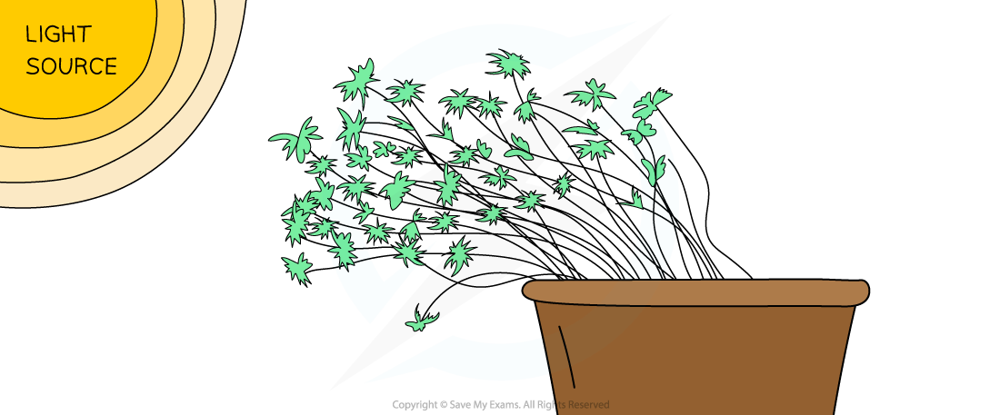
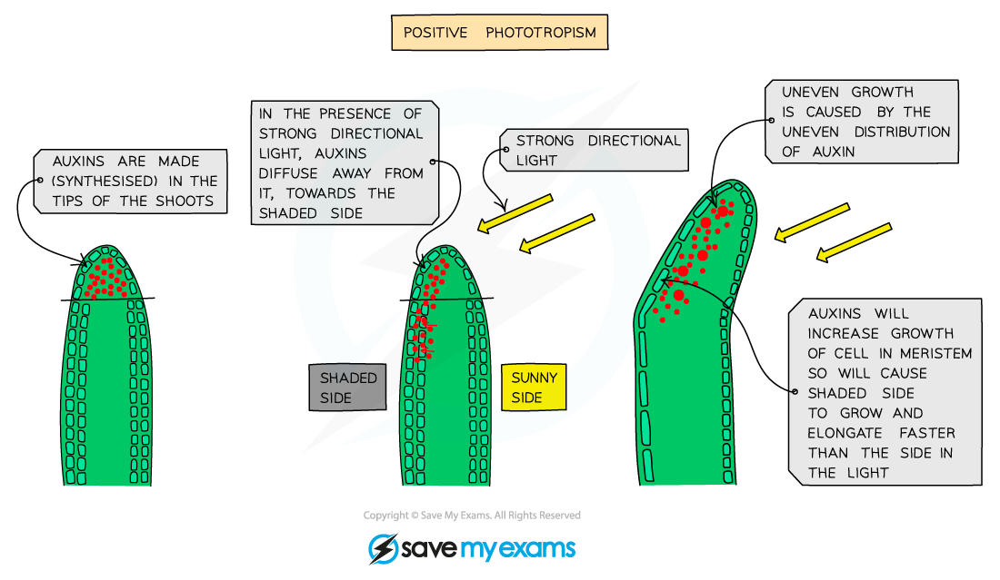

# Response to Stimuli: Plants

## Response to Stimuli: Plants

> **Spec point** — `spcpt_7rCPTs42HTrQmBzG` · understand that plants respond to stimuli

## Response to Stimuli: Plants

- Plants need to be able to grow in response to certain **stimuli**
- For example, plants need to be able to grow **in response to light**, to ensure their leaves can absorb light for **photosynthesis**
- They also need to be able to grow** in response to gravity**, to ensure that shoots grow upwards and roots grow downwards
- The **directional growth responses** made by plants in response to light and gravity are known as **tropisms**
- If the growth is **towards** the stimulus, the tropism is **positive** and if the growth is **away from** the stimulus, the tropism is **negative**

## Geotropic & Phototropic Responses of Plants

> **Spec point** — `spcpt_YzqSzzmWhQmMP3py` · describe the geotropic and phototropic responses of roots and stems

## Geotropic & Phototropic Responses of Plants

- A response to light is a **phototropism** and a response to gravity is a **geotropism** (or gravitropism)
- As **shoots** grow **upwards**, away from gravity and towards light (so that leaves are able to absorb sunlight), shoots show a **positive** **phototropic** response and a **negative** **geotropic** response
- As** roots **grow **downwards** into the soil, away from light and towards gravity (in order to anchor the plant and absorb water and minerals from the soil), roots show a **negative** **phototropic** response and a **positive** **geotropic** response

#### Geotropism and phototropism table

| **Stimulus** | **Name of response** | **Definition** | **Positive response** | **Negative response** |
|---|---|---|---|---|
| Light | Phototropism | Growth towards or away from the direction of the light source | Growth towards the light source (e.g. by shoots) | Growth away from the light source (e.g. roots) |
| Gravity | Geotropism | Growth towards or away from the source of gravity | Growth towards the source of gravity (e.g. by roots) | Growth away from the source of gravity (e.g. shoots) |

***Plant shoots display a positive phototropic response by growing towards a light source***

## The Role of Auxin in Phototropism

> **Spec point** — `spcpt_j3XQQVY5QNFzp8MY` · understand the role of auxin in the phototropic response of stems

## The Role of Auxin in Phototropism

- Plants produce **plant growth regulators** (similar to hormones in animals) called **auxins** to **coordinate** and **control** directional growth responses such as phototropisms and geotropism
- Auxin is mostly made in the tips of growing shoots and then diffuses down to the region where **cell division** **occurs** (just below the tip)

  - This is an important point - only the region behind the tip of a shoot is able to contribute to growth by cell division and cell elongation
- Auxin stimulates the cells in this region to **elongate** (get larger); the more auxin there is, the faster they will elongate and grow
- If light shines all around the tip, auxin is distributed** evenly** throughout and the cells in the shoot grow at the **same rate** - this is what normally happens with plants growing outside
- When light shines on the shoot **predominantly from one side**, the auxin produced in the tip concentrates on the **shaded side**, making the cells on that side **elongate** and **grow** faster than the cells on the sunny side
- This unequal growth on either side of the shoot causes the shoot to **bend** and **grow in the direction of the light**

***Positive phototropism in plant shoots is a result of auxin accumulating on the shaded side of a shoot***

> **Exam Hint**
> Make sure you are specific with your use of the term 'cell elongation' when answering exam questions on this topic. If you just say that the shoot 'grows towards the light' then that could imply that cell division takes place when it does not. Auxin causes the cells that already exist to get longer, it does not cause the overall number of cells to increase.
