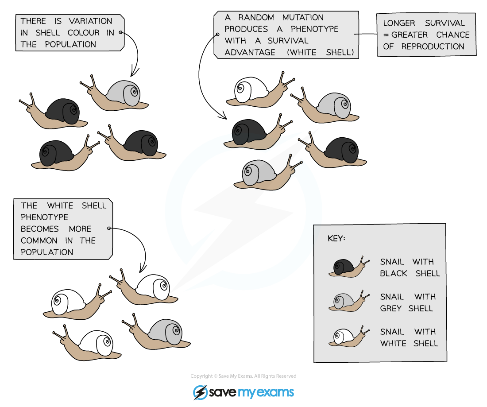
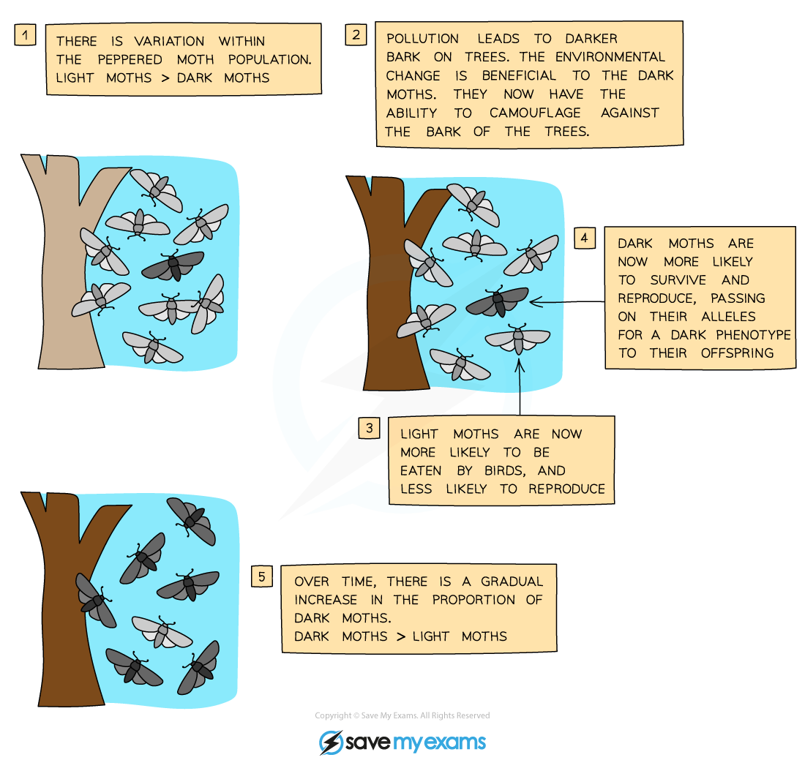

# Darwin's Theory of Evolution by Natural Selection

## Darwin's Theory of Evolution by Natural Selection

> **Spec point** — `spcpt_kkvrpJ2MMwqkTvbH` · explain Darwin’s theory of evolution by natural selection

## Darwin's Theory of Evolution by Natural Selection

- Charles Darwin proposed the **theory of evolution by natural selection**
- Darwin's theory states that **evolutionary change** has occurred, and that **natural selection is the process** that has driven this change

- The process of natural selection is as follows:

  - Individuals in a species show** variation** that is caused by differences in genes
  - Individuals with characteristics that are advantageous in their** **environment have a **higher chance of survival**
  
    - This idea of natural selection became known as ‘survival of the fittest'
  - Surviving individuals are** more likely to reproduce **and so are **more likely to pass on** their advantageous alleles
  - Over many generations the advantageous** **characteristics become **more common in the population**

### Examples of evolution by natural selection

#### Example 1: snail shell colour

#### Example 2: peppered moth colour

> **Exam Hint**
> There are many examples of natural selection, and an exam question may present an unfamiliar one for you to explain; it is important to learn the basic stages so that you can apply them to any example provided
> 
> - All populations contain genetic **variation, **which may be caused by mutations
> - Some genetic variants will result in characteristics that are advantageous and **increase survival chances**
> - Surviving individuals are** more likely to reproduce** and **pass on** their advantageous alleles to their offspring
> - Over many generations the advantageous alleles become **more common** in the population
