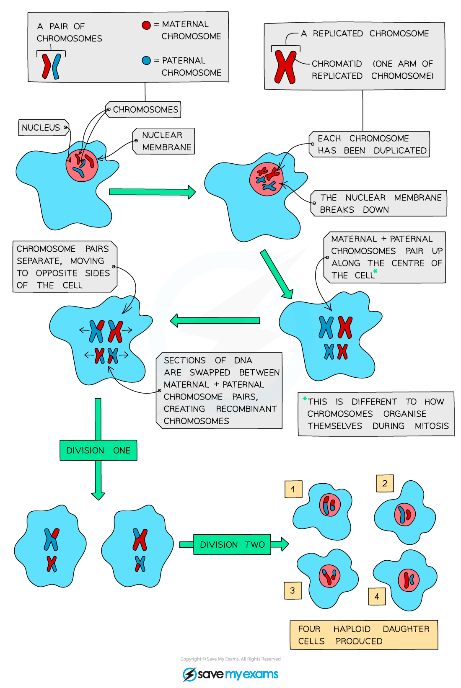
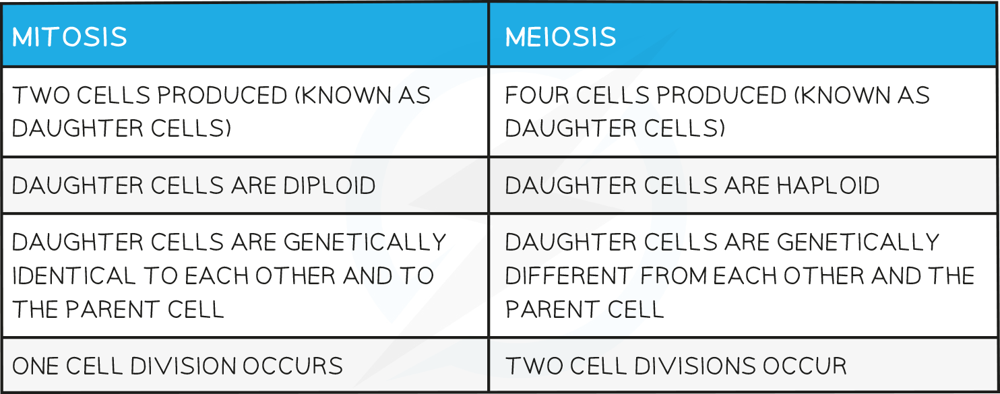

# Meiosis

## Meiosis

> **Spec point** — `spcpt_Ckph7WsWPYtcv3GS` · understand how division of a cell by meiosis produces four cells, each with half the number of chromosomes, and that this results in the formation of genetically different haploid gametes

## Meiosis

- Meiosis is a type of **nuclear division** that gives rise to cells that are **genetically different**
- During meiosis, the number of chromosomes must be** halved** to form the new cells; these new cells are called **gametes **(sex cells)

  - We describe gametes as being **haploid** - having half the normal number of chromosomes
  - There would be double the number of chromosomes after they join at fertilisation in the zygote (fertilized egg) if this did not happen
- Meiosis is important for

  - The production of **gametes **e.g. sperm cells and egg cells, pollen grains and ovum
  - Increasing **genetic variation** of offspring

#### The process of meiosis

- Meiosis starts with chromosomes doubling themselves, as in mitosis, and lining up in the centre of the cell
- After this has happened the cells **divide twice** so that only one copy of each chromosome passes to each gamete

  - **First division**: chromosomes pair up along the centre of the cell, then cell fibres will pull the pairs apart, and each new cell will have one chromosome pair
  - **Second division**: chromosomes will line up along the centre of these cells, and cell fibres will pull them apart
- A total of **four haploid daughter cells** will be produced, these are the **gametes**

***The process of cell division by meiosis to produce haploid gamete cells***

## Comparing Mitosis & Meiosis

> **Spec point** — `spcpt_nNMTzc3PZPpMmSx9`

## Comparing Mitosis & Meiosis

#### Comparing Mitosis & Meiosis Table

> **Exam Hint**
> Questions on cell division often ask for differences between mitosis and meiosis. Learn two or three and remember to BE SPECIFIC when giving your answer. You should also know the reasons for a specific type of cell division taking place and the types of cells where each happen.
