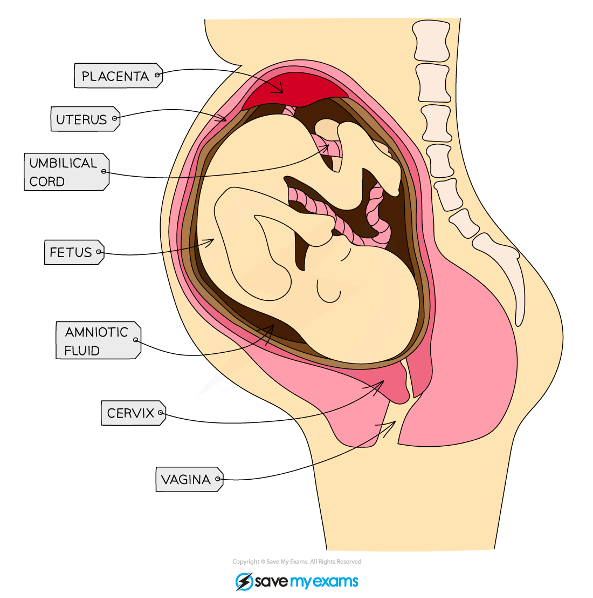

# Amniotic Fluid

## Amniotic Fluid

> **Spec point** — `spcpt_RKMBHQjqkBFr7rXn` · understand how the developing embryo is protected by amniotic fluid

## Amniotic Fluid

- In the uterus the developing embryo is surrounded by **amniotic fluid**

  - Amniotic fluid is contained within the** amniotic membrane**, also known as the **amniotic sac**
- The amniotic fluid** protects the embryo/fetus** during development by cushioning it from bumps** **when the mother moves around

***The foetus in the uterus is protected by amniotic fluid***
