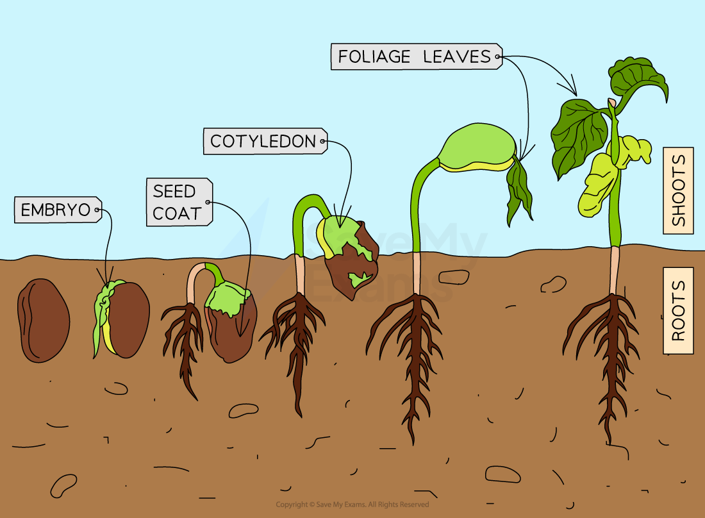

# Germinating Seeds

## Germination

> **Spec point** — `spcpt_jmfGBCYqT6DSrZTC` · understand how germinating seeds utilise food reserves until the seedling can carry out photosynthesis

## Germination

- The **seeds** of plants contain:

  - an embryo shoot
  - an embryo root
  - seed leaves, known as cotyledons
  - a food store, containing starch and other nutrients
- During germination the embryo plant begins to grow, using up** food reserves** from the **food store**

  - Enzymes inside the seed break down the stored starch in the seed's food store into maltose and then glucose
  - Glucose is used in** respiration** to release energy for growth of the shoot and the root
- The food store provides nutrients and energy for the growing seedling until larger leaves emerge, at which point **photosynthesis** can begin and the new plant can produce its own food

*Food stores inside seeds provide nutrients needed for the embryo roots and shoots to begin growth*
