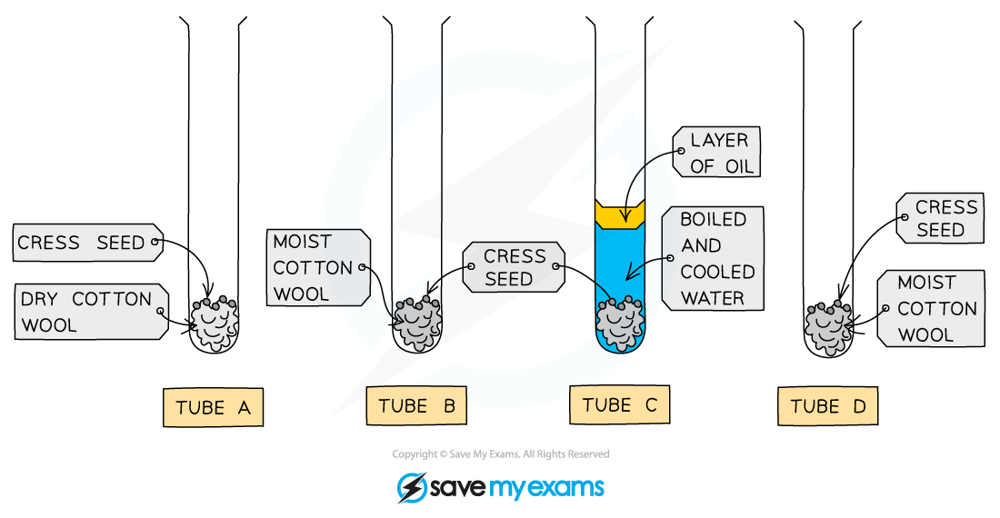

# Practical: Conditions for Germination

## Practical: Conditions for Germination

> **Spec point** — `spcpt_XbThyPj2rwQKyW7t` · practical: investigate the conditions needed for seed germination

## Practical: Conditions for Germination

- **Germination** marks the beginning of **seed growth**
- Three key factors are needed for successful germination:

  - **Water:** swells the seed, breaks the seed coat, and **activates enzymes** for growth
  - **Oxygen**: necessary for **respiration** to provide** energy**
  - **Warmth: **increases **enzyme activity** and improves germination until a certain temperature

#### Apparatus

- Test tubes
- Test tube holder
- Cress seeds
- Cotton wool
- Fridge

#### Method

- Prepare four test tubes with 10 cress seeds on cotton wool, labeled A, B, C, and D

  - **Tube A**: Keep the cotton wool dry
  - **Tube B**: Moisten the cotton wool with water
  - **Tube C**: Cover the seeds and cotton wool with water and add a layer of oil on top
  - **Tube D**: Moisten the cotton wool and place the tube in a fridge (4°C)
- Keep tubes A, B, and C at room temperature or around 20°C
- After 3-5 days, ensure the cotton wool in tubes B and D stays moist
- Compare the number of germinated seeds in each tube

***Conditions required for germination: how to set up the experiment***

#### Results and Analysis

- The test tubes are set up to test the necessity of water, oxygen, and warmth for germination by removing each factor in turn:

  - Tube A: Water is absent
  - Tube B: Control, all factors present
  - Tube C: Oxygen is blocked by oil and water layers
  - Tube D: Warmth is removed by refrigeration
- As germination requires **all three factors**, only the seeds in the control tube (B) are expected to germinate

#### Conditions required for germination: Example results table

| Test tube | Factor being tested | Seeds germinated |
|---|---|---|
| A | Water / moisture | No |
| B | Control (all factors present) | Yes |
| C | Oxygen | No |
| D | Warm temperature | No |

#### Applying CORMS to practical work

- The CORMS prompt can be applied when designing a germination investigation

***The CORMS prompt***

- The **CORMS** for the above investigation would look something like this:

  - **C** - changing the abiotic conditions in which the seeds are germinating
  - **O** - the cress seeds will all be taken from the same parent plant (or at least from the same species of cress plant)
  - **R** - repeat the investigation several times to ensure our results are reliable
  - **M1** - measure how many seeds in each test tube germinate
  - **M2** - ...after a set time period (eg. 3 days)
  - **S** - control the temperature for tubes A, B and C, the type of water used (ie. sterile water, which is made by first boiling then cooling water)
