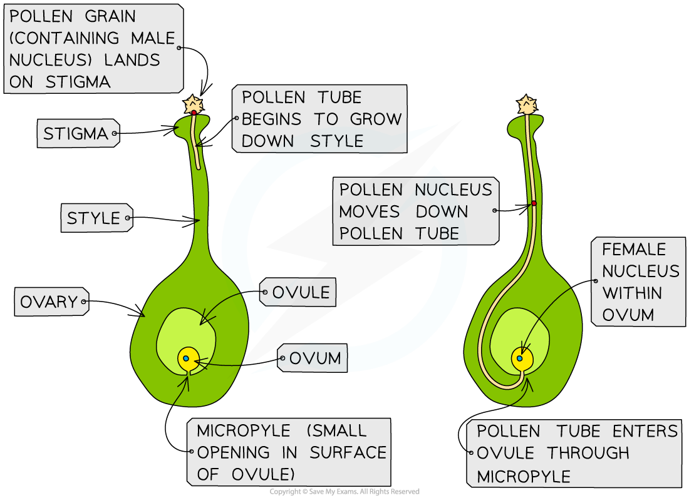

# The Process of Fertilisation in Plants

## Fertilisation & Fruit Formation

> **Spec point** — `spcpt_wv3gZTtXny5BbJQv` · understand that the growth of the pollen tube followed by fertilisation leads to seed and fruit formation

## Fertilisation & Fruit Formation

### Fertilisation

- After successful pollination a **pollen tube** forms to deliver the male nucleus to the egg cell, or ovum, in the ovary of a flower

  - The pollen tube grows down the **style** towards the **ovary**
  - The **pollen grain** travels down the pollen tube

- **Fertilisation** occurs when the pollen nucleus and the ovum nucleus **fuse together** to form a ***zygote***

***The pollen nucleus travels down a pollen tube before fusing with a female nucleus during fertilisation***

### Seed and fruit formation

- After fertilisation the **ovule** develops into a **seed**
- The parts of the flower surrounding the ovule develop into a **fruit**, which contains the seeds
- Fruits provide a mechanism for **seed dispersal**, e.g.

  - some fruits are eaten by animals, which then disperse the seeds in their droppings
  - some fruits have sticky hooks that get caught in the fur of passing animals

> **Exam Hint**
> Students often get confused between pollination and fertilisation in plants, but they are not the same thing.
> 
> - Pollination = pollen landing on the stigma of a flower
> - Fertilisation = fusion of the male and female nuclei
