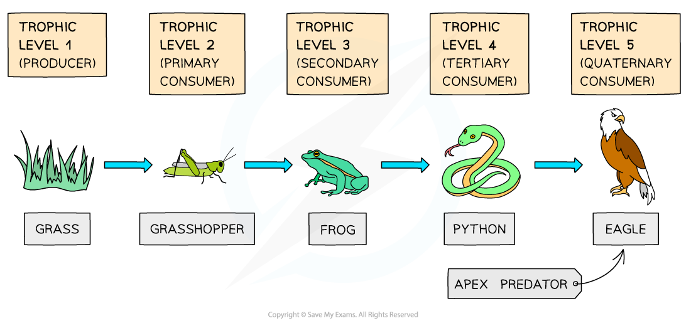

# Trophic Levels

## Trophic Levels

> **Spec point** — `spcpt_WHd43yvp9f8dvP3t` · understand the names given to different trophic levels, including producers, primary, secondary and tertiary consumers and decomposers

## Trophic Levels

- The trophic level is the position of an organism within a particular food chain
- Within a food web an organism can be in different food chains and have a different trophic level for each

| **Level** | **Organisms** | **Energy transfer** |
|---|---|---|
| First trophic level | Producers (plants, algae) | Producers convert light energy from the sun into chemical energy stored in glucose during photosynthesis. |
| Second trophic level | Primary consumers | Eat producers and transfer chemical energy from plant tissues into their own. |
| Third trophic level | Secondary consumers | Eat primary consumers and gain energy from their tissues. |
| Fourth trophic level | Tertiary consumers | Eat secondary consumers and gain energy from their tissues. |

- At any trophic level organisms produce waste, or may die; the energy in waste or dead matter is then transferred to **decomposers **(bacteria and fungi)

  - Decomposers break down dead organisms and waste, recycling nutrients back into the ecosystem
