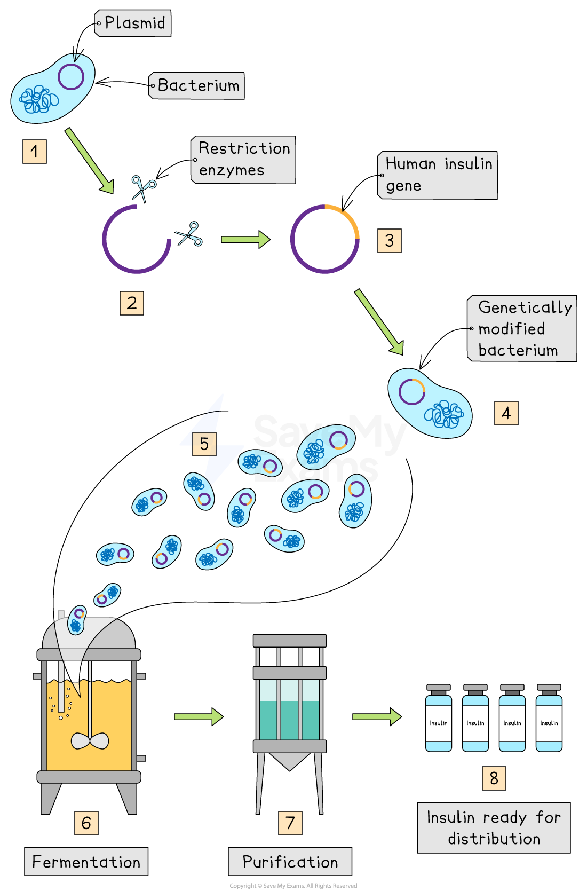

# Manufacturing Human Insulin

## Manufacturing Insulin

> **Spec point** — `spcpt_qHKrwgYsGyy8kJRz` · understand how large amounts of human insulin can be manufactured from genetically modified bacteria that are grown in a fermenter

## Manufacturing Insulin

- The gene for **human insulin** can be inserted into **bacteria** which then produce human insulin
- The insulin can be **collected** and **purified** for medical use to treat people with **diabetes**

#### The process of producing insulin from GM bacteria

- The gene for insulin production is located within a human chromosome
- **Restriction enzymes** are used to isolate or ‘cut out’ the human insulin gene, leaving it with **‘sticky ends**’ (a short section of unpaired bases)
- A bacterial plasmid is **cut by the same restriction enzyme leaving it with corresponding sticky ends** (plasmids are circles of DNA found inside bacterial cells)
- The plasmid and the isolated human insulin gene are **joined** together by **DNA ligase enzyme**

  - If two pieces of DNA have **matching sticky ends** (because they have been **cut by the same restriction enzyme**), DNA ligase will link them to form a single, unbroken molecule of DNA
- The genetically engineered (recombinant) plasmid is **inserted into a bacterial cell**
- When the bacteria reproduce, the **plasmids are copied as well** and so a recombinant plasmid can **quickly be spread** as the bacteria multiply. All the new bacteria will **express the human insulin gene** and make the **human insulin protein**
- The genetically engineered bacteria can be placed in a fermenter to reproduce quickly in controlled conditions and make large quantities of the human protein

***Production of human insulin***

- Bacteria are extremely useful for genetic engineering purposes because:

  - They contain the **same genetic code** as the organisms we are taking the genes from, meaning they can easily ‘read’ it and **produce the same proteins**
  - There are **no ethical concerns over their manipulation and growth **(unlike if animals were used, as they can feel pain and distress)
  - The **presence of plasmids** in bacteria, separate from the main bacterial chromosome, makes them **easy to remove and manipulate** to insert genes into them and then place back inside the bacterial cells

> **Exam Hint**
> In an exam you may be asked to apply your knowledge of genetic modification to a new scenario so it is important to understand how the steps of this process can be applied to real life scenarios like producing insulin.
