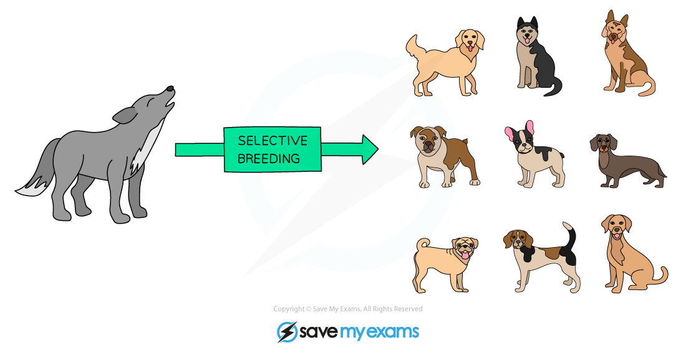

# Selective Breeding in Animals

## Selective Breeding in Animals

> **Spec point** — `spcpt_Ztd9qWfyHPnZpRD9` · understand how selective breeding can develop animals with desired characteristics

## Selective Breeding in Animals

- Selective breeding in animals is a similar process to selective breeding in plants
- Individuals with the desired characteristics are **bred together **(often several different parents all with the desired characteristics are chosen so siblings do not have to be bred together in the next generation)
- **Offspring** that show the **desired characteristics are selected and bred together**
- This process is **repeated for many successive generations**
- Animals are commonly selectively bred for various characteristics, including:

  - Cows, goats and sheep that produce lots of **milk** or **meat**
  - Chickens that lay large **eggs**
  - Domestic dogs that have a gentle nature
  - Sheep with good quality wool
  - Horses with fine features and a very fast pace
- An example of an animal that has been selectively bred by humans in many ways to produce breeds with many different characteristics is the domestic dog, all breeds of which are descended from wolves:

***Selective breeding has produced many different breeds of domestic dog***

#### Natural selection vs artificial selection table

| **Natural selection** | **Artificial selection** |
|---|---|
| Occurs naturally | Only occurs when humans intervene |
| Results in development of populations with features that are better adapted to their environment and survival | Results in development of populations with features that are useful to humans and not necessarily useful to the survival of the individual |
| Usually takes a long time to occur | Takes less time as only individuals with the desired features are allowed to reproduce |

> **Exam Hint**
> Make sure that you include the need to repeat the selective breeding process for **many generations** in any exam answer you give – selecting two parents with desired characteristics, breeding them and stopping there is not selective breeding and will not give rise to a new breed.
