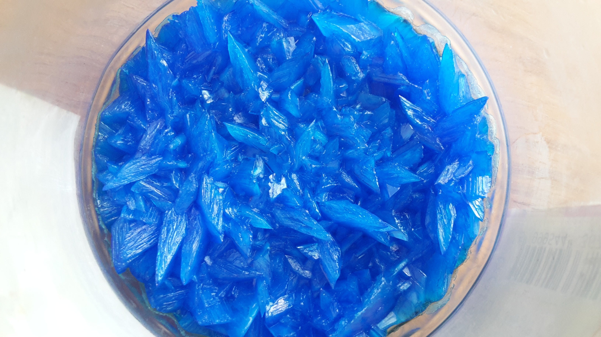

# How to Prepare a Soluble Salt

## Prepare a Soluble Salt

> **Spec point** — `spcpt_7NzGGpVsQP8gFhhP`

## Prepare a soluble salt

- A soluble salt can be made from the reaction of an acid with an insoluble base
- During the preparation of soluble salts, the insoluble reactant is added in excess to ensure that** all** of the **acid** has **reacted**
- If this step is not completed, any unreacted acid would become **dangerously** concentrated during evaporation and crystallisation
- The excess reactant is then removed by** filtration** to ensure that only the salt and water remain
- Since all of the acid has reacted and the excess solid base has been removed then the solution left can only be salt and water
- The water is evaporated by heating until small crystals begin to appear

  - This is typically once half of the water is left
  - Allowing the filtered solution to evaporate slowly over a period of days results in the formation of larger crystals
- If a carbonate was used as the solid base instead of an oxide or hydroxide, then any carbon dioxide gas produced would have been released into the atmosphere
- A common example is the [preparation of copper(II) sulfate](https://www.savemyexams.com/igcse/science/edexcel/double-award-modular/24/chemistry-unit-1/revision-notes/inorganic-chemistry/salt-preparations/copper-sulfate-preparation/) which can be made with copper(II) oxide and dilute sulfuric acid:

**CuO (s) + H****2****SO****4 ****(aq) ⟶ CuSO****4 ****(aq) + H****2****O (l)**

#### Copper sulfate crystals

***After filtering and heating copper sulfate crystals will form. Larger crystals will form if the water in the solution is left to evaporate slowly***

**Photo by ****[Wikimedia commons](https://commons.wikimedia.org/wiki/File:Copper_Sulfate_Crystals.jpg)**

- The acid could also be reacted with a metal to produce the salt, as long as the metal is above hydrogen in the reactivity series and not too reactive so that a dangerous reaction does not take place

> **Exam Hint**
> Exam questions often ask why the solid oxide is added in excess. This is done to avoid leaving any unreacted acid which would become dangerously concentrated during evaporation and crystallisation.
