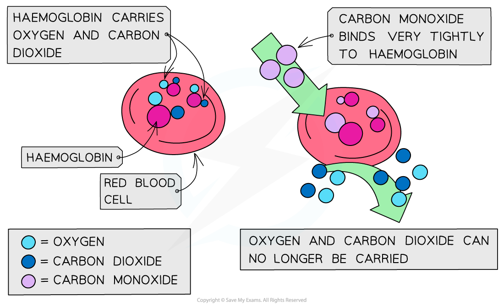

# Combustion of Fuels

## Fuels & Combustion

> **Spec point** — `spcpt_PHtw8GcfS37gtQXV`

## Combustion of fuels

### The combustion of fossil fuels

- A fuel is a substance that, when burned, releases heat energy (exothermic reaction)
- The [combustion](https://www.savemyexams.com/igcse/science/edexcel/double-award-modular/24/chemistry-unit-1/revision-notes/organic-chemistry/introduction-to-organic-chemistry/classifying-organic-reactions/) of fossil fuels is the major source of atmospheric pollution

  - Fossil fuels include: **coal**, **oil**, **natural gas**, **oil shales** and tar sands
- Non-renewable fossil fuels are obtained from **crude oil** by fractional distillation
- Petrol is used as a fuel in **cars**, kerosene is used to fuel **aircraft** and diesel oil is used as a fuel in some cars, trucks and **heavy vehicles** such as tanks and trains
- Coal is used in power stations and also steel production
- Natural gas consists mainly of **methane**, CH4
- There are finite amounts of fossil fuels and they all contribute to **pollution** and **global** warming
- All these fuels contain carbon, hydrogen and small quantities of sulfur

### Combustion products

- The burning of fossil fuels releases the gases **carbon dioxide**, **carbon monoxide**, **oxides of nitrogen** and **oxides of sulfur**
- In addition incomplete combustion of the fuels gives rise to **unburned hydrocarbons** and **carbon particulates**
- When the fuel is a **hydrocarbon** then **water** and **carbon dioxide** are the products formed
- Hydrocarbon compounds undergo **complete** and **incomplete** combustion

### Complete combustion

- Complete combustion occurs when there is **excess oxygen**
- For example, the combustion equation for propane is:

**C****3****H****8 ****+ 5O****2**** → 3CO****2**** + 4H****2****O**

### Incomplete combustion

- Incomplete combustion occurs when there is **insufficient oxygen** to burn
- It occurs in some appliances such as **boilers** and **stoves** as well as in** internal combustion** engines
- The products of these reactions are unburnt fuel (soot), carbon monoxide and water
- Methane, for example, undergoes incomplete combustion in an oxygen-poor environment:

**2CH****4 ****+ 3O****2****→ 2CO + 4H****2****O**

**CH****4 ****+ O****2****→ C + 2H****2****O**

> **Exam Hint**
> You don't need to learn these equations, but you do need to be able to predict the products of combustion given the composition of the fuel and the conditions.

## Dangers of Carbon Monoxide

> **Spec point** — `spcpt_vZjYX4xF9D5rZsRk`

## Carbon monoxide

### Why is carbon monoxide dangerous?

- Carbon monoxide is a toxic and odourless gas which can cause dizziness, loss of consciousness and eventually death #### Carbon monoxide binding to haemoglobin

  - The CO binds well to haemoglobin which therefore cannot bind oxygen
  - Oxygen is transported to organs

***The high affinity of CO to haemoglobin prevents it from binding to O******2****** ***

> **Exam Hint**
> Though CO2 is not a **toxic **gas, it is still a **pollutant **causing **global warming **and **climate change**
