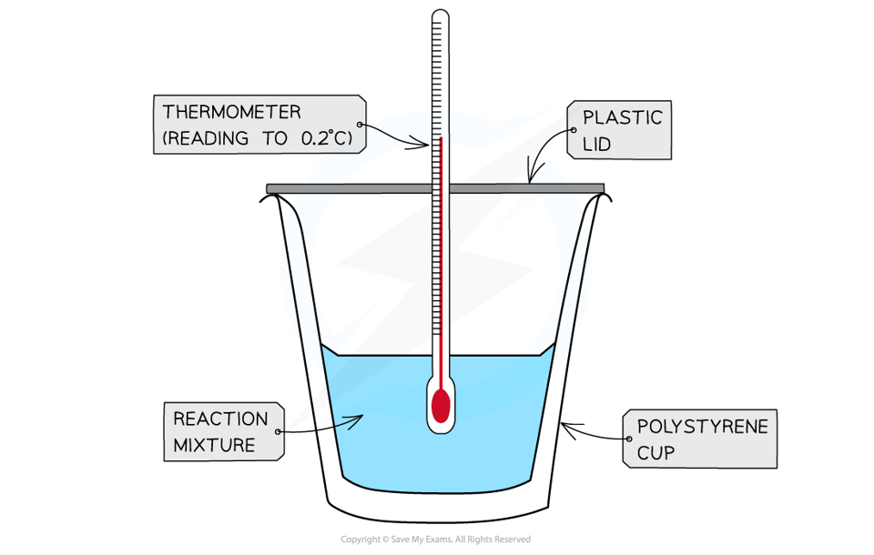
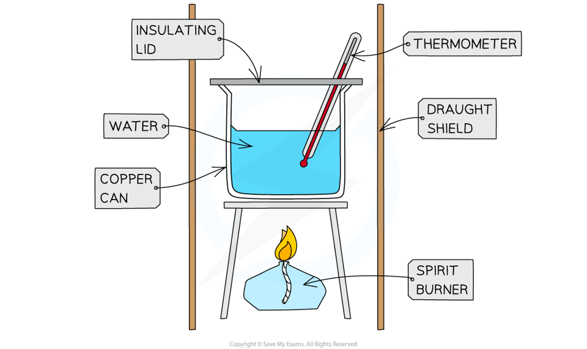

# Calorimetry

## Calorimetry

> **Spec point** — `spcpt_nqm89K4PgqN5Wbct`

## Calorimetry

- We can experimentally determine the relative amounts of energy released by a fuel
- We do this using** simple** **calorimetry**
- There are two types of calorimetry experiments you need to know:

  - **Enthalpy** changes of **reactions in solution**
  - **Enthalpy** changes of **combustion **

### Reactions in solution

- To calculate the amount of energy produced by a chemical reaction in **solution **we measure the temperature change when the solutions are mixed together
- The solutions need to be mixed together in an **insulated **contain to prevent heat loss
- This method can be used for:

  - [Neutralisation ](https://www.savemyexams.com/igcse/science/edexcel/double-award-modular/24/chemistry-unit-1/revision-notes/inorganic-chemistry/acids-alkalis-and-titrations/acids-alkalis-and-neutralisation/)reactions
  - Dissolving solids in water
  - [Displacement](https://www.savemyexams.com/igcse/science/edexcel/double-award-modular/24/chemistry-unit-1/revision-notes/inorganic-chemistry/metal-reactivity-series/metal-displacement-reactions/) reactions

- For the purposes of the calculations, some assumptions are made about the experiment:

  - That the specific heat capacity of the solution is the same as pure water, i.e. **4.18 J/g/°C**
  - That the density of the solution is the same as pure water, i.e. **1 g/cm****3**
  - The specific heat capacity of the container is ignored
  - The reaction is complete
  - There are negligible heat losses
- A **calorimeter** can be made up of a **polystyrene drinking cup**, a **vacuum flask** or **metal can**

#### A simple calorimeter

***A polystyrene cup can act as a calorimeter to find enthalpy changes in a chemical reaction***

- Method:

  1. A **fixed volume** of one reagent is added to the calorimeter and the** initial temperature** taken with a thermometer
  2. An **excess** amount of the second reagent is added and the solution is stirred continuously
  3. The **maximum temperature** is recorded and the temperature rise calculated
- The energy released would be calculated using:

**Q = m x c x Δ*****T***

- Q = the heat energy change, J
- m = the mass of the substance being heated, g
- c = the specific heat capacity, J/g/°C
- Δ*T* = the temperature change, °C

### Enthalpy of combustion experiments

- The principle here is to use the heat released by a combustion reaction to increase the heat content of water
- A typical simple calorimeter is used to measure the temperature changes to the water

#### Diagram to show the set up of calorimetry equipment

***A lid is used to prevent heat loss***

- The steps are:

  1. Measure a fixed volume of water into a copper can
  2. Weigh the spirit burner containing  a fuel using a balance
  3. Measure the initial temperature of the water
  4. Burn the fuel and stir the water
  5. Wait until the temperature has risen by approximately 20 oC and extinguish the flame
  6. Record the final temperature of the water and re-weigh the spirit burner
- To calculate the energy released by the fuel we can use the data obtained from the experiment above and the specific heat capacity of water
- The **specific heat capacity**, c, is the energy needed to raise the temperature of 1 g of a substance by 1 °C

  - The specific heat capacity of water is 4.18 J/g/°C
- The heat energy change is calculated using:

**Q = m x c x Δ*****T***

- Q = the heat energy change, J
- m = the mass of the substance being heated, g
- c = the specific heat capacity, J/g/°C
- Δ*T* = the temperature change, °C

#### Sources of error

- Not all the heat produced by the combustion reaction is transferred to the water

  - Some heat is lost to the surroundings
  - Some heat is absorbed by the calorimeter
- To minimise the heat losses the copper calorimeter should not be placed too far above the flame and a lid placed over the calorimeter
- Shielding can be used to reduce draughts
- In this experiment the main sources of error are

  - **Heat losses**
  - **Incomplete combustion**

> **Exam Hint**
> For both types of calorimetry experiment you should be able to give an outline of the experiment and be able to process experimental data.
