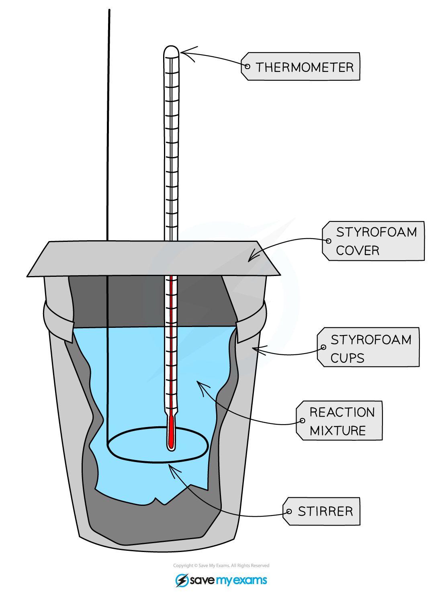

# Practical: Investigating Temperature Changes

## Practical: Investigating Temperature Changes

> **Spec point** — `spcpt_pRpRdpvKzwmrXMMR`

## Practical: Investigating Temperature Changes

### Aim:

- To perform a calorimetry study of the reaction between HCl and NaOH

### Apparatus:

- Dilute hydrochloric acid
- Dilute sodium hydroxide solution
- Styrofoam (polystyrene) calorimeter & lid
- 25 cm3 measuring cylinder
- Thermometer & stirrer

#### Simple calorimeter

***A lid is required to prevent heat loss***

### Method:

1. Using a measuring cylinder, place 25 cm3 of the NaOH solution into the calorimeter
2. Measure and record the temperature of the solution
3. Add 5 cm3 of the dilute HCl and stir
4. Measure and record the highest temperature reached by the mixture
5. Repeat steps 1 – 4 increasing the amount of acid added by 5 cm3 each time

### Results:

- Record your results in a suitable table

| **Volume of acid (cm****3****)** | **Temperature (****o****C)** |
|---|---|
| 5 |   |
| 10 |   |
| 15 |   |
| 20 |   |
| 25 |   |

- Plot a graph of the results and draw a line of best fit, using the graph to determine what volume of acid causes the biggest change in temperature

### Conclusion:

- The larger the difference in the temperature the more energy is absorbed or released
