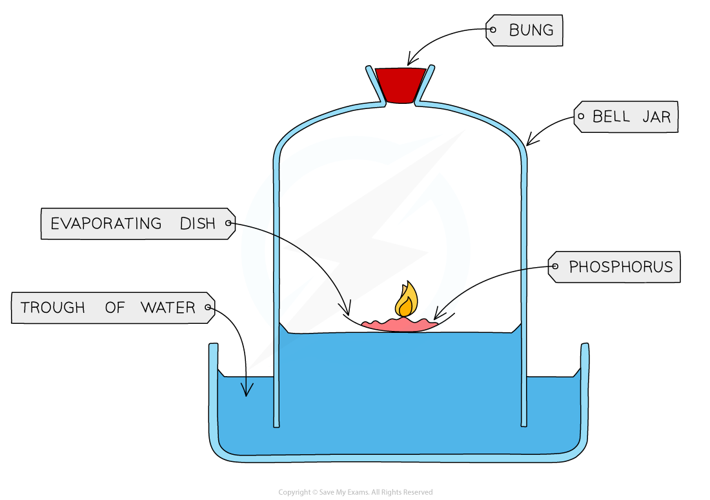

# Composition of Air

## Composition of Air

> **Spec point** — `spcpt_B3by6xCJpGJ8b7tw`

## Composition of air

## Composition of the atmosphere

- The proportion of gases in the air has not changed much in 200 million years
- The composition of the atmosphere today is:

  - About four-fifths **(approximately 80%) nitrogen**
  - about one fifth **(approximately 20%) oxygen **
  - small proportions of other gases including carbon dioxide, water vapour and trace quantities of the noble gases

#### The composition of the atmosphere

***The atmosphere mainly consists of nitrogen and oxygen***

> **Exam Hint**
> Although the proportion of carbon dioxide is very small, it plays a substantial role in global warming as a greenhouse gas.

## Finding the Percentage of Oxygen

> **Spec point** — `spcpt_G284gXq5gFVc9djK`

## Finding the percentage of oxygen

- The percentage of oxygen in air can be found by reacting a metal or non-metal with the oxygen in a fixed volume of air
- One way to carry this out is to burn a small amount of **phosphorus** in a bell jar that is sitting in a trough of water
- Initially the water levels are the **same** inside and outside the jar

#### Finding the percentage of oxygen

***The percentage of oxygen in air can be determined by burning phosphorus in air and measuring the volume change***

- As the phosphorus burns it uses up the oxygen inside the bell jar and the **water level rises**
- By making careful measurements of water levels before and after the experiment you can determine the percentage of oxygen in the air
- Phosphorus is very suitable for this experiment as it burns readily until all the available oxygen is used up
- A disadvantage of this experiment is that phosphorus is toxic, so it is hazardous and great care must be taken to handle it safely
