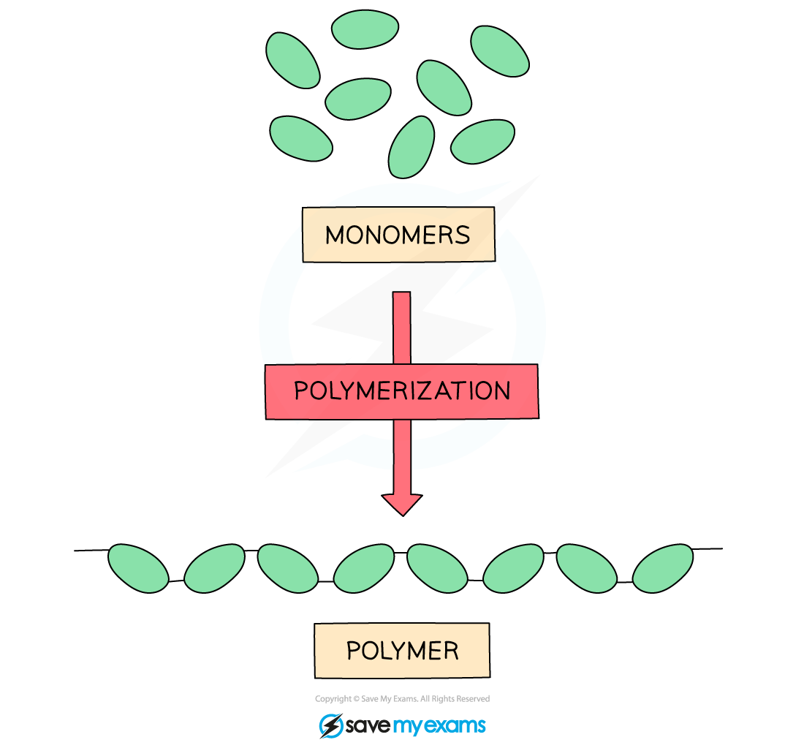
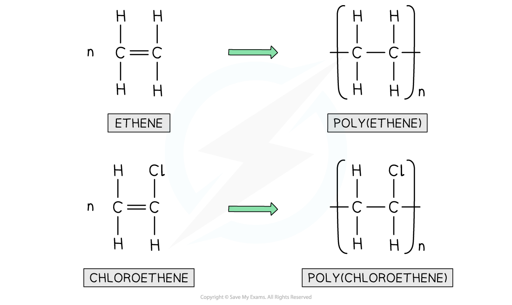

# What are Addition Polymers?

## Monomers

> **Spec point** — `spcpt_zrWCBRRbwDMBbqrY`

## Monomers

- Polymers are large molecules of **high relative molecular mass** and are made by linking together large numbers of smaller molecules called **monomers**

  - This process is called **addition polymerisation**
- Each monomer is a **repeat unit** and is connected to the adjacent units via **covalent bonds**
- Polymerisation reactions usually require **high pressures** and the use of a **catalyst**
- Many everyday materials such as** resins, plastics, polystyrene** cups,** nylon** etc. are polymers
- These are manufactured and are called** synthetic** polymers
- Nature also produces polymers which are called **natural** or **biological** polymers

**Forming polymers from monomers **

***Diagram showing how lots of monomers bond together to form a polymer***

## Drawing Polymers

> **Spec point** — `spcpt_7jg5zgWzPQsFCy2g`

## Drawing polymers

- Addition polymers are formed by the joining up of many monomers and only occurs in monomers that contain C=C bonds
- **One** of the bonds in each C=C bond breaks and forms a bond with the adjacent monomer with the polymer being formed containing **single bonds** only
- Many polymers can be made by the addition of alkene monomers
- Others are made from alkene monomers with different atoms attached to the **monomer** such as chlorine or a hydroxyl group
- The name of the polymer is deduced by putting the name of the monomer in brackets and adding poly- as the **prefix**
- For example if propene is the alkene monomer used, then the name is **polypropene**
- Polyethene is formed by the addition polymerisation of **ethene monomers**

#### Drawing polymers from the monomer

> **Exam Hint**
> Poly(ethene), poly(propene), poly(chloroethene) and (poly)tetrafluoroethene are the four polymers named in the specification so make sure you can draw the monomer and repeating unit for each one.

## Deducing Monomers & Repeat Units

> **Spec point** — `spcpt_Vj2fjb7dCn6cBJFY`

## Deducing monomers and repeat units

### Deducing the monomer from the polymer

- Polymer molecules are very large compared with most other molecule
- **Repeat units** are used when displaying the formula
- To draw a repeat unit, change the double bond in the monomer to a **single bond** in the repeat unit
- Add a bond to each end of the repeat unit
- The bonds on either side of the polymer must **extend** outside the brackets (these are called extension or continuation bonds)
- A small **subscript** n is written on the bottom right hand side to indicate a large number of repeat units
- Add on the rest of the groups in the **same order** that they surrounded the double bond in the monomer

#### The monomer & repeat unit

***Diagram showing the concept of drawing a repeat unit of a monomer***

### Deducing the polymer from the monomer

- Identify the repeating unit in the polymer
- Change the single bond in the repeat unit to a **double bond** in the monomer
- Remove the bond from each end of the repeat unit and the subscript **n** (which can be placed in front of the monomer)

#### The repeat unit & monomer

***Diagram showing the monomer of the repeat unit of polymer***
