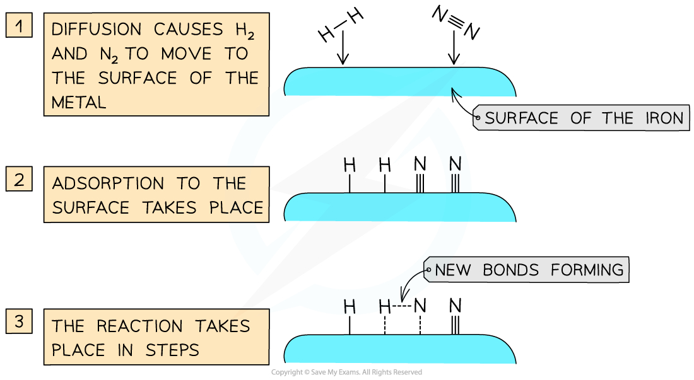

# What are Catalysts?

## Catalysts & Rates

> **Spec point** — `spcpt_KCQsXKzVr4ST4m6r`

## The effect of a catalyst on rate of reaction

- Catalysts are substances which **speed up **the **rate** of a reaction without themselves being **altered** or **consumed** in the reaction

  - Normally only **small** **amounts** of catalysts are needed to have an effect on a reaction
  - The mass of a catalyst at the beginning and end of a reaction is the **same**
- Catalysts do not form part of the chemical equation but they are sometimes seen above or below the reaction arrow:

N2 (g) + 3H2 (g) `rightwards harpoon over leftwards harpoon from 450 space degree straight C comma space 200 space atm to iron space catalyst of
` 2NH3 (g)

SO2 (g) + O2 (g) `rightwards arrow from straight V subscript 2 straight O subscript 5 space catalyst to 450 space degree straight C of` SO3 (g)

- Different processes require different types of catalysts but they all work on the same principle:

  - They provide an **alternative pathway **for the reaction to occur
  - The alternative pathway has a **lower activation energy**

***Catalysts work by attracting reactant molecules on to the surface and so providing an alternate reaction pathway of lower energy***

- Catalysis is a very important  branch of chemistry in commercial terms as catalysts increase the rate of reaction (hence the production rate) and they reduce energy costs
- The transition metals are used widely as catalysts as they have variable oxidation states allowing them to readily** donate** and **accept** different numbers of electrons

  - This is key to their catalytic activity
- Enzymes act as catalysts in biological systems
