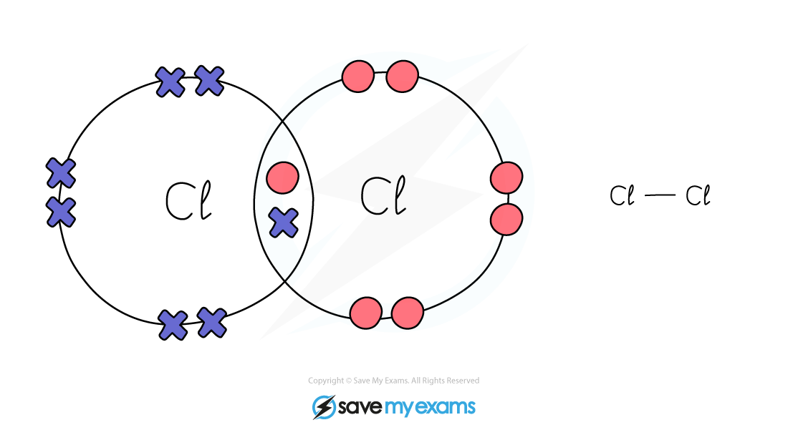
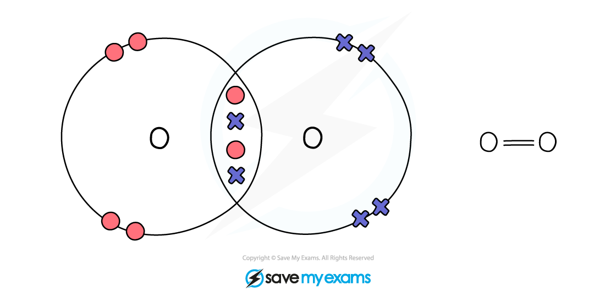
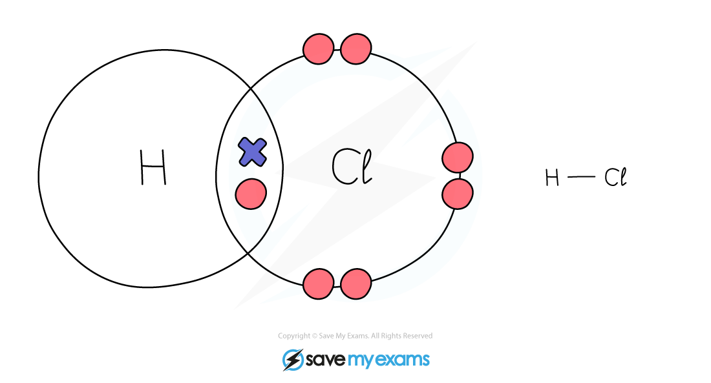
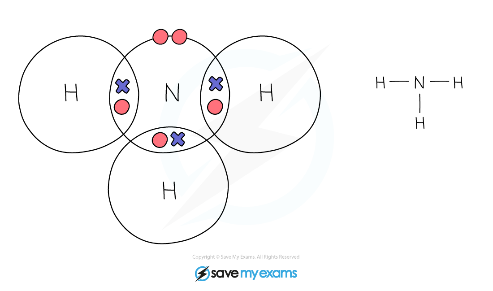
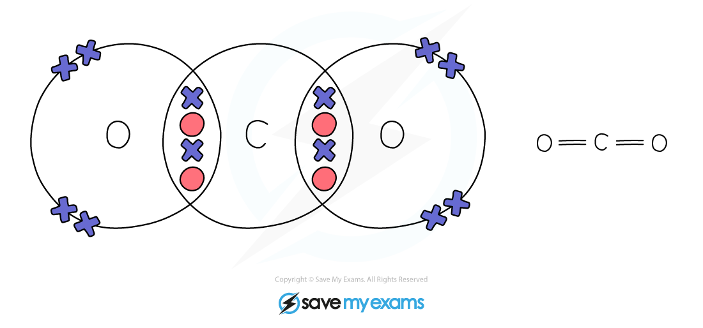
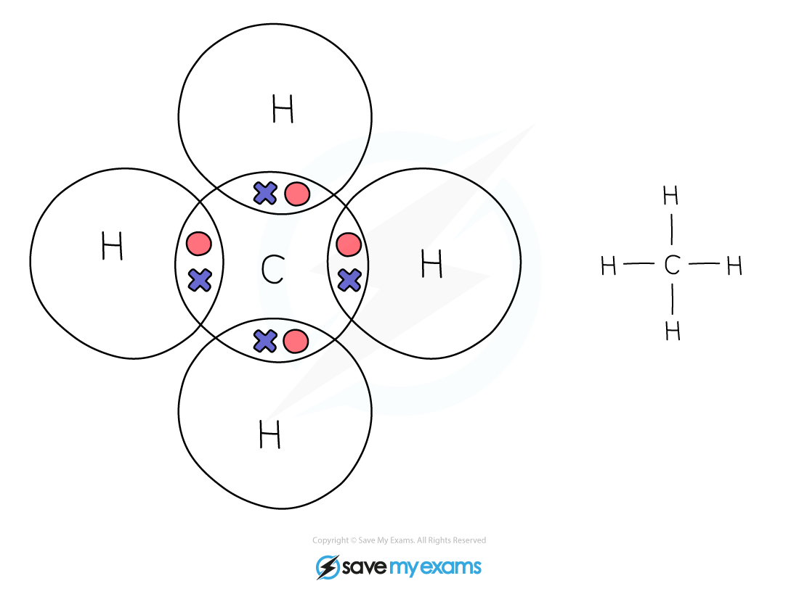

# Covalent Bonds: Dot & Cross Diagrams

## Covalent Bonds: Dot & Cross Diagrams

> **Spec point** — `spcpt_54rFt6VnHDjnKPGp`

## Dot and cross diagrams for covalent compounds

- Covalent substances tend to have simple molecular structures, such as Cl2, H2O or CO2
- These small molecules are known as **simple molecules**
- Small covalent molecules can be represented by dot and cross diagrams
- You need to be able to describe and draw the structures of the molecules below:

### Diatomic molecules

***Dot & cross representation of a molecule of hydrogen***

***Dot & cross representation of a molecule of chlorine***

***Dot & cross representation of a molecule of oxygen***

***Dot & cross representation of a molecule of nitrogen***

***Dot & cross representation of a molecule of hydrogen chloride***

#### Inorganic molecules

***Dot & cross representation of a molecule of water***

***Dot & cross representation of a molecule of ammonia***

***Dot & cross representation of a molecule of carbon dioxide***

### Organic molecules

***Dot & cross representation of a molecule of methane***

***Dot & cross representation of a molecule of ethane***

***Dot & cross representation of a molecule of ethene***

> **Exam Hint**
> Each covalent bond represents one shared pair of electrons.
> 
> For example, there are two covalent bonds between the two oxygen atoms in O2 so four electrons are shared.
