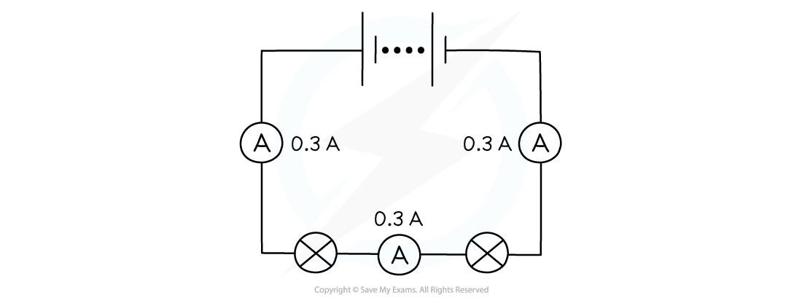
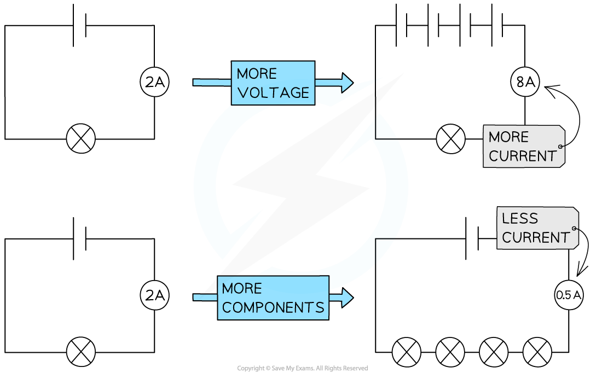
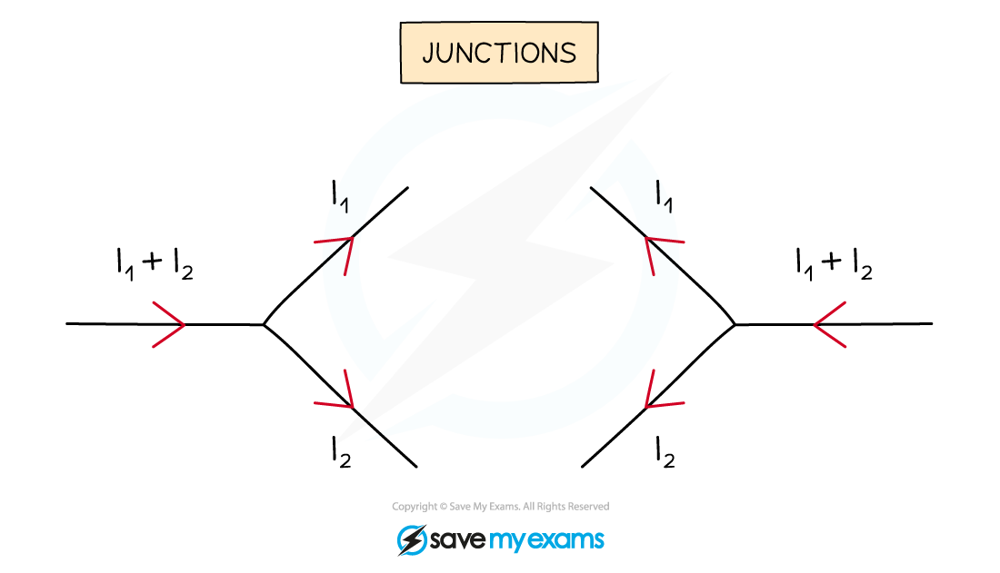

# Current in Series & Parallel

## Current in series circuits

> **Spec point** — `spcpt_X59Yh6drzYJwNP69` · understand how the current in a series circuit depends on the applied voltage and the number and nature of other components

## Current in series circuits

- There are two ways of joining electrical components:

  - in **series**
  - in **parallel**

### Current in series

- A **series **circuit is a circuit that has only one loop, or one path that the electrons can take
- In a series circuit, the current has the **same value at any point**

  - This is because the electrons have only one path they can take
  - Therefore, the number of electrons passing a fixed point per unit time is the same at all locations

- This means that **all **components in a series circuit have the same current

***The current is the same at each point in a series circuit***

- The amount of current flowing in a series circuit depends on:

  - the **voltage** of the power source
  - the **number** (and type) of components

- **Increasing** the **voltage** of the power source drives **more** **current** around the circuit

  - So, decreasing the voltage of the power source reduces the current

- **Increasing** the **number** of components in the circuit **increases** the **total** **resistance**

  - Hence **less** **current** flows through the circuit

#### Increasing the voltage and number of components in series

***Current will increase if the voltage of the power supply increases and decreases if the number of components increases***

## Current in parallel circuits

> **Spec point** — `spcpt_j86qcYjfCKzzdP8h` · understand why current is conserved at a junction in a circuit

## Current in parallel circuits

- A parallel circuit is a circuit that has two or more loops, or more than one path that electrons can take
- Parallel circuits contain **junctions **and **branches**

  - Junctions are points where two or more wires meet to form a new branch
  - Branches are the sections of wire between junctions

### Current in parallel

- In a parallel circuit, the current has different values at different points in the circuit

  - This is because the current **splits **at a junction
  - Therefore, the electrons have different paths they can take

- The **sum** of the current in the **individual **branches is equal to the **total **current before (and after) the branches

***Current splits at a junction into individual branches***

#### Why is current conserved at a junction in a circuit?

- At a junction, the current is always **conserved**

  - This means the amount of current flowing into the junction is equal to the amount of current flowing out of it
  - This is because the **charge **is conserved

- Current does not always split equally – often there will be more current in some branches than in others

  - The current in each branch will only be identical if the resistance of the components along each branch is **identical**

- Current behaves in this way because it is the **flow of electrons**:

  - Electrons, or any charge, cannot be created or destroyed
  - This means the total number of electrons (and hence current) going around a circuit must remain the same
  - When the electrons reach a junction, however, some of them will go one way and the rest will go the other

> **Worked Example**
> In the circuit below, ammeter A0 shows a reading of 10 A, and ammeter A1 shows a reading of 6 A.
> 
> 
> 
> What is the reading on ammeter A2?
> 
> **Answer:**
> 
> **Step 1: Recall what happens to the current at a junction**
> 
> - At a junction, the current splits, but is always conserved
> - This means that the total amount of current flowing into a junction is equal to the total amount flowing out
> 
> **Step 2: Consider the first junction in the circuit where the current splits**
> 
> - The diagram below shows the first junction in the circuit
> 
> 
> 
> **Step 3: Calculate the missing amount of current**
> 
> - Since 10 A flows into the junction (the total current from the battery), 10 A must flow out of the junction
> - The question says that 6 A flows through ammeter A1 so the remaining current flowing through ammeter A2 must be:
> 
> 10 A − 6 A = **4 A**
> 
> - Therefore, **4 A** flows through ammeter A2

> **Exam Hint**
> The direction of current flow is super important when considering junctions in a circuit.
> 
> You should remember that current flows from the **positive** terminal to the **negative** terminal of a cell / battery. This will help determine the direction current is flowing 'in' to a junction and which way the current then flows 'out'.
> 
> 
