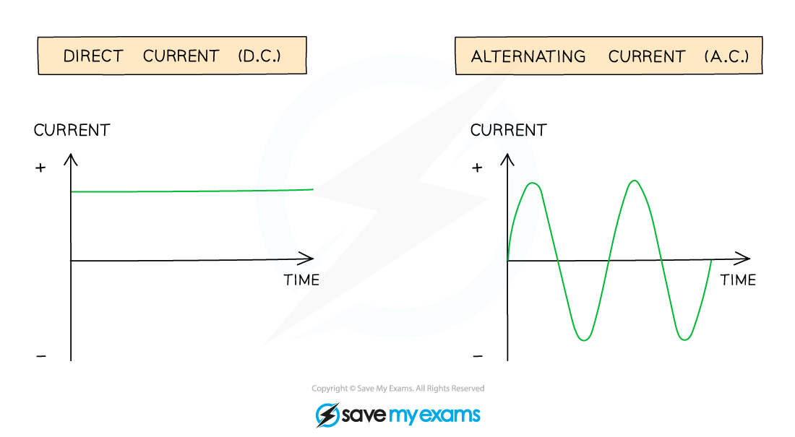

# A.C. & D.C.

## A.C. & D.C.

> **Spec point** — `spcpt_V7rPTrCs3kCn3vbp` · know the difference between mains electricity being alternating current (a.c.) and direct current (d.c.) being supplied by a cell or battery

## A.C. & D.C.

- Mains electricity can be supplied by **alternating current** (a.c.) or **direct current** (d.c.) from a cell or battery

### Direct current

- A direct current (d.c.) is defined as

**A steady current, constantly flowing in the same direction in a circuit, from positive to negative**

- The potential difference across a cell in a d.c. circuit travels in **one direction only**

  - The current travels from the positive terminal to the negative terminal
- A d.c. power supply has a **fixed **positive terminal and a fixed negative terminal
- Electric **cells**, or **batteries**, produce direct current (d.c.)

#### A cell or battery provides a d.c. supply to a circuit

***Circuits powered by cells or batteries use a d.c. supply***

### Alternating current

- An alternating current (a.c.) is defined as

**A current that continuously changes its direction, going back and forth around a circuit**

- An alternating current power supply has two identical terminals that **change **from positive to negative and back again

  - The alternating current always travels from the positive terminal to the negative terminal
  - Therefore, the current c**hanges direction** as the polarity of the terminals changes
- The **frequency** of an alternating current is the number of times the current changes direction back and forth each second

  - In the UK, **mains electricity** is an **alternating** current with a frequency of 50 Hz and a potential difference of around 230 V

#### Graphs of direct current vs alternating current on an oscilloscope screen

***Two graphs showing the variation of current with time for alternating current and direct current***

### Comparing alternating current & direct current

- The following table summarises the differences between d.c. and a.c.

#### Direct current vs. alternating current table

| **Direct Current (d.c.)** | **Alternating Current (a.c.)** |
|---|---|
| Continuous and in one direction | Constantly changing direction |
| Produced by cells and batteries | Produced by electrical generators i.e. mains electricity |
| Has a positive and negative terminal | Has two identical terminals |

> **Exam Hint**
> If asked to explain the difference between alternating and direct current, sketching and labelling the graphs above can earn you full marks. All the circuits you have studied so far are d.c. circuits. Don't be put off by an exam question if you are asked to calculate the current, potential difference or resistance in d.c. series circuits, you don't have to do anything different from what you have already learned!
