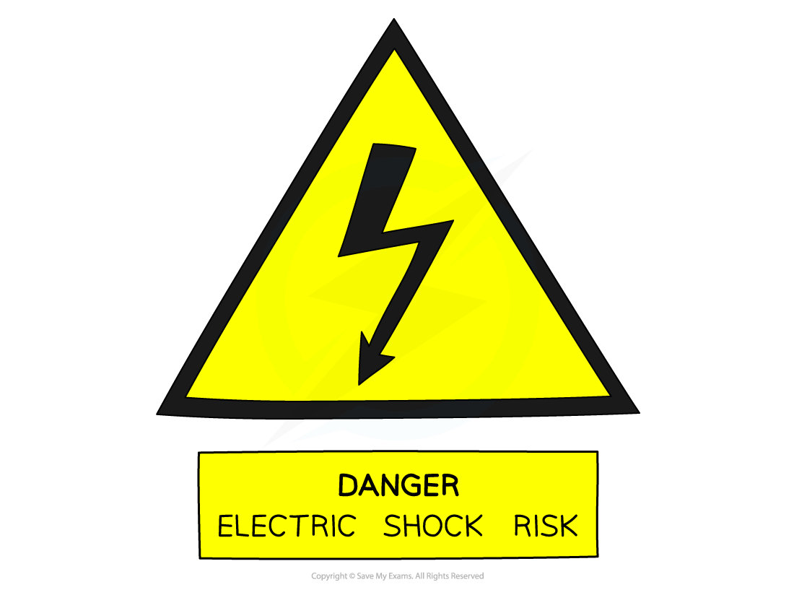
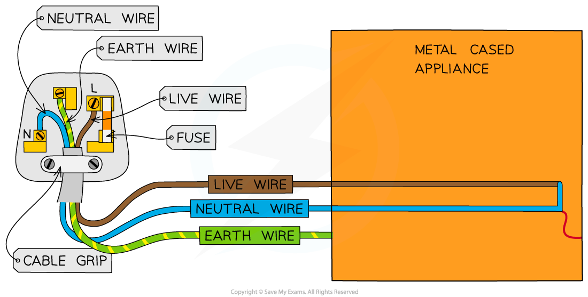
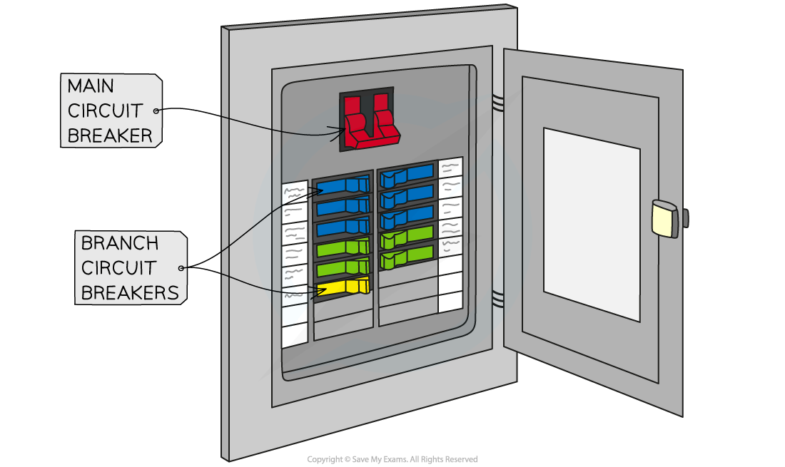

# Electrical Safety

## Electrical safety

> **Spec point** — `spcpt_xmNTDbh9JQRWHPTc` · understand how the use of insulation, double insulation, earthing, fuses and circuit breakers protects the device or user in a range of domestic appliances

## Electrical safety

- Mains electricity is potentially lethal

  - Potential differences as small as 50 V can pose a serious hazard to individuals

#### An important symbol for electrical safety

***Signs, like the above, warn of the risk of electrocution***

- Common electrical safety hazards include:

  - **Damaged Insulation** – if someone touches an exposed piece of wire, they could be subjected to a lethal shock
  - **Overheating of cables** – passing too much current through too small a wire (or leaving a long length of wire tightly coiled) can lead to the wire overheating. This could cause a fire or melt the insulation, exposing live wires
  - **Damp conditions** – if moisture comes into contact with live wires, it could conduct electricity either causing a short circuit within a device (which could cause a fire) or posing an electrocution risk

- To protect the user or the device, there are several safety features built into domestic appliances, including:

  - Double insulation
  - Earthing
  - Fuses
  - Circuit breakers

### Insulation & double insulation

- The conducting part of a wire is usually made of copper or some other metal

  - If this comes into contact with a person, this poses a risk of electrocution
- To improve electrical safety wires are covered with an insulating material, such as rubber

#### Insulating electrical wires to improve electrical safety

***The conducting part of a wire is covered in an insulating material for safety***

- Some appliances do not have metal cases, so there is no risk of them becoming electrified
- Such appliances are said to be **double insulated**, as they have two layers of insulation:

  - Insulation around the wires themselves
  - A non-metallic case that acts as a second layer of insulation

- Double insulated appliances do not require an earth wire or have been designed so that the earth wire cannot touch the metal casing

### Earthing

- Many electrical appliances have metal cases
- This poses a potential electrical safety hazard:

  - If a live wire (inside the appliance) came into contact with the case, the case would become electrified and anyone who touched it would risk being electrocuted
- The earth wire is an additional safety wire that can reduce this risk

#### The earth wire is an electrical safety feature

***A diagram showing the three wires going to a mains powered appliance: live, neutral and earth***

- If this happens:

  - The earth wire provides a** low resistance path to the earth**
  - It causes a **surge of current in the earth wire** and hence also in the live wire
  - The high current through the fuse causes it to **melt and break**
  - **This cuts off the supply of electricity to the appliance**, making it safe

### Fuses & circuit breakers

- Fuses and circuit breakers are electrical safety devices designed to **cut off the flow of electricity **to an appliance if the** current becomes too large** (due to a fault or a surge)

  - As explained in the [Selecting fuses](https://www.savemyexams.com/igcse/science/edexcel/double-award-modular/24/physics-unit-1/revision-notes/electricity/electrical-power-mains-electricity/electrical-power-fuses/) revision note a fuse consists of a glass cylinder containing a metal wire
  - A **circuit breaker** consists of an automatic electromagnet switch that breaks the circuit if the current exceeds a certain value

#### A circuit breaker is the most important electrical safety feature in houses

***The main circuit breaker can quickly shut off electricity to the whole house. The branch circuit breakers can shut off electricity to specific areas of the house***

- A circuit breaker has a major advantage over a fuse as an electrical safety device because:

  - It doesn't melt and break, hence it can be reset and used again
  - It works much faster

- For these reasons, circuit breakers are used in mains electricity in homes as the most important electrical safety device

  - Sometimes they are misleadingly named "Fuse boxes"

> **Exam Hint**
> For your exam, you must explain how insulation, double insulation, earthing, fuses and circuit breakers protect the device or user in different domestic appliances.
