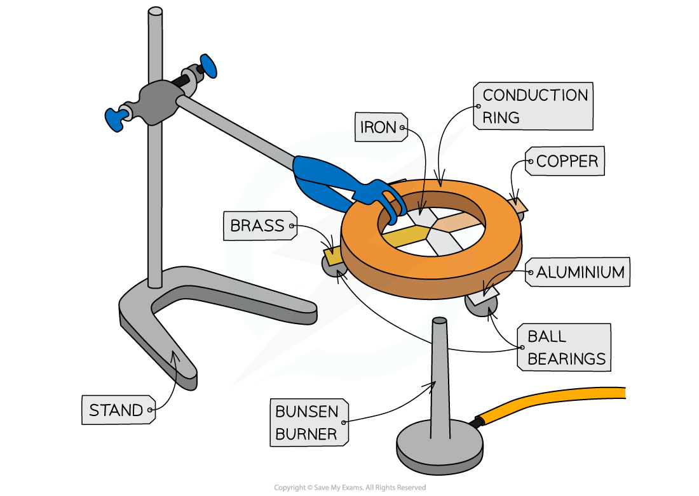
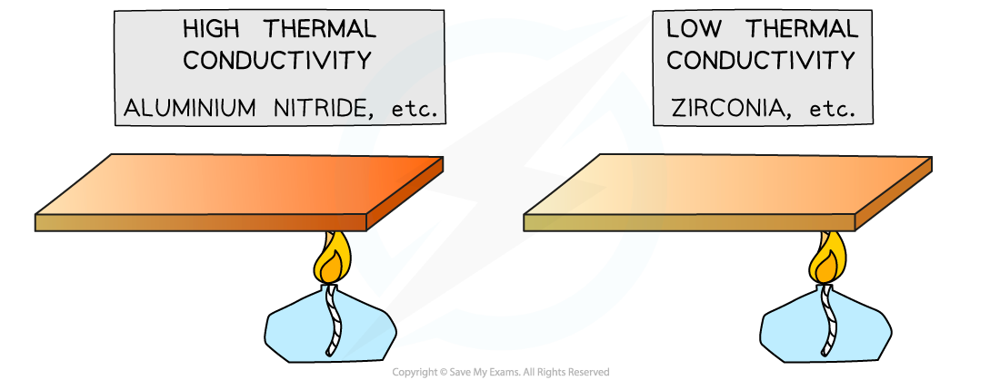
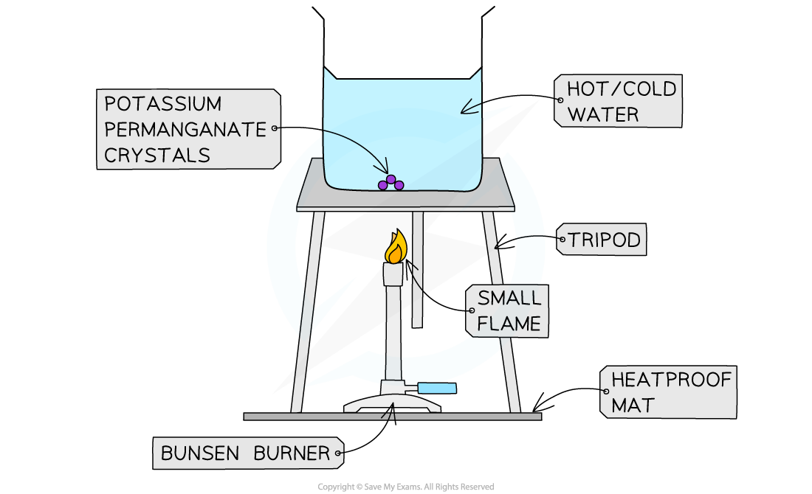
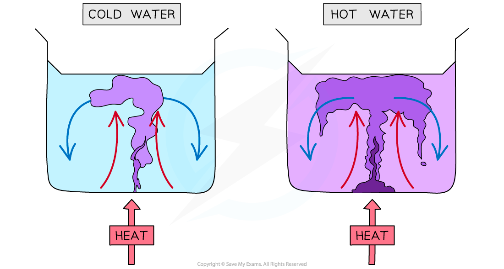
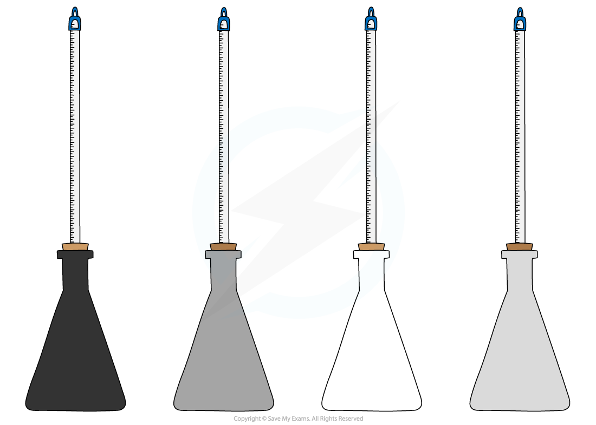
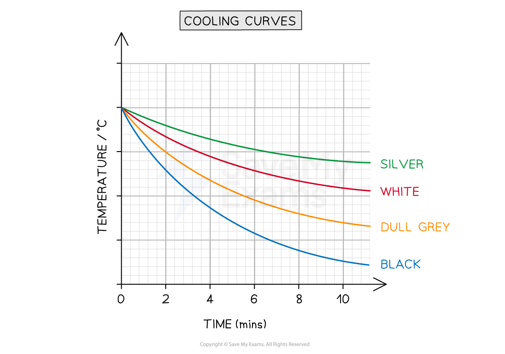

# Core Practical: Investigating Thermal Energy

## Core practical 8: investigating thermal energy

> **Spec point** — `spcpt_gJQ4vcdt87wKzRkY` · Core practical 8: investigate thermal energy transfer by conduction, convection and radiation

## Practical: Investigating thermal energy

### Experiment 1: Investigating conduction

#### Aim of the experiment

- The aim of the experiment is to investigate the rate of conduction in four different metals

#### Variables

- ***Independent variable*** = Type of metal
- ***Dependent variable*** = Rate of conduction
- Control variables:

  - Size and thickness of metal strips
  - Amount of wax used
  - Identical ball bearings

#### Equipment list

| **Equipment** | **Purpose** |
|---|---|
| Bunsen burner | To heat substances |
| Heatproof mat | To protect surfaces |
| Stop watch | To measure time |
| Conduction ring (with rods of iron, copper, brass and aluminium) | Different metals to investigate the thermal conductivity of |
| Ball bearings | To attach to the ends to the metal strips |
| Wax | To attach ball bearings to metal strips |
| Clamp stand | To hold the conduction ring |

- ***Resolution*** of measuring equipment:

  - Stopwatch = 0.01 s

#### Method

***The above apparatus consists of 4 different metal strips of equal width and length arranged around an insulated circle***

1. Attach ball bearings to the ends of each metal strip at an equal distance from the centre, using a small amount of wax
2. The strips should then be turned upside down and the centre heated gently using a bunsen burner so that each of the strips is heated at the central point where they meet
3. When the heat is conducted along to the ball bearing, the wax will melt and the ball bearing will drop
4. Time how long this takes for each of the strips and record in a table
5. Repeat the experiment and calculate an average of each time

#### Analysis of results

- Order the metals according to their thermal conductivity

  - The first ball bearing to fall will be from the rod that is the best thermal conductor
- This is because materials with **high** thermal conductivity **heat up faster** than materials with **low** thermal conductivity

***Examples of materials with high and low thermal conductivity***

- The results should show that the conductivity, ranked from highest to lowest, is:

  - Copper (fastest time for ball bearing to fall)
  - Aluminium
  - Brass
  - Iron (slowest time for ball bearing to fall)

### Experiment 2: investigating convection

#### Aims of the experiment

- The aim of the experiment is to investigate the rate of convection of potassium permanganate crystals in two different temperatures of water

#### Variables:

- ***Independent variable*** = Temperature of water
- ***Dependent variable*** = Rate of convection
- Control variables:

  - Amount of water in beaker
  - Size of Bunsen burner flame
  - Size of potassium permanganate crystal

#### Equipment list

| **Equipment** | **Purpose** |
|---|---|
| Bunsen burner | To heat the beaker of water |
| Heatproof mat | To protect surfaces |
| Stop watch | To measure time |
| Potassium permanganate crystals | To show the convection current |
| Tripod and gauze | To place the beaker on |
| Beaker | To contain the water and crystal |
| Forceps | To handle the crystals |

- ***Resolution*** of measuring equipment:

  - Stopwatch = 0.01 s

#### Method

***Apparatus used to investigate potassium permanganate crystals undergoing convection in water***

1. Fill the beaker with cold water (not too full) and place it on top of a tripod and heatproof mat
2. Pick up the crystal using forceps and drop it into the centre of the beaker – do this carefully to ensure the crystal does not dissolve prematurely
3. Heat the beaker using the Bunsen burner and record observations
4. Repeat experiment with hot water and record observations

#### Analysis of Results

- Energy is initially transferred from the Bunsen flame through the glass wall of the beaker by conduction
- The water in the region of the Bunsen flame is heated and the space between the water molecules expands, therefore, the water becomes **less dense** and **rises**

  - This causes the dissolved purple crystal to flow upwards with the water
- Meanwhile, when the water at the top of the beaker cools, there is less space between the water molecules and the water becomes **denser** again and falls downwards
- The process continues which leads to a **convection current** where energy is transferred through the liquid

  - The dissolved purple crystal follows this current which can be clearly observed during this experiment

- It should be observed that the convection current is faster in hot water

  - This is because the higher the **temperature**, the higher the** kinetic energy** of the water molecules
- Therefore, in hot water, the water molecules and the the molecules of potassium permanganate move around the beaker faster

### Experiment 3: investigating radiation

#### Aims of the experiment

The aim of the experiment is to investigate how the amount of infrared radiation absorbed or radiated by a surface depends on the nature of that surface

#### Variables

- ***Independent variable*** = Colour
- ***Dependent variable*** = Temperature
- Control variables:

  - Identical flasks (except for their colour)
  - Same amounts of hot water
  - Same starting temperature of the water
  - Same time interval

#### Equipment list

| **Equipment** | **Purpose** |
|---|---|
| Heatproof mat | To protect surfaces and reduce heat loss |
| Stop watch | To measure time taken for cooling |
| Kettle | To boil water |
| 4 thermometers | To measure the water temperature in each flask |
| Flasks painted different colours (black, dull grey, white, silver) | To investigate the heat loss of different colours |

- ***Resolution*** of measuring equipment:

  - Thermometer = 1°C
  - Stopwatch = 0.01 s

#### Method

***Different coloured beakers for investigating infrared radiation apparatus***

1. Set up the four identical flasks painted in different colours: black, grey, white and silver
2. Fill the flasks with hot water, ensuring the measurements start from the same initial temperature
3. Note the starting temperature, then measure the temperatures at regular intervals, e.g. every 30 seconds for 10 minutes

#### Results

#### Example results table

#### Analysis of results

- All objects emit **infrared radiation**, but the hotter an object is, the more infrared waves are emitted
- The intensity (and wavelength) of the emitted radiation depends on:

  - The **temperature** of the body (hotter objects emit more thermal radiation)
  - The **surface area** of the body (a larger surface area allows more radiation to be emitted)
  - The **colour** of the surface

- Most of the energy lost from the beakers will be** by heating** due to **conduction **and **convection**

  - This will be **equal **for each beaker, as colour does not affect energy transferred by conduction and convection
- Any **difference** in energy transferred away from each beaker must, therefore, be due to infrared **radiation**
- To compare the rate of energy transfer away from each flask, plot a graph of **temperature** on the y-axis against **time** on the x-axis and draw curves of best fit

- The expected results are shown on the graph below:

***Example graph of the expected results for the different coloured beakers***

#### Evaluating the experiments

*Systematic errors*

- For experiment 1:

  - Allow the rods to cool to room temperature before heating so that they all begin at the same temperature
- For experiment 3:

  - Make sure the starting temperature of the water is the same for each material since this will cool very quickly
  - It is best to do this experiment in pairs to coordinate starting the stopwatch and immersing the thermometer
  - Use a data logger connected to a digital thermometer to get more accurate readings

*Random errors*

- For experiment 1:

  - Avoid handling the rods and the wax too much before heating
- For experiment 3:

  - Make sure the hole for the thermometer isn’t too big, otherwise, thermal energy will escape through the hole
  - Take repeated readings for each coloured flask
  - Read the values on the thermometer at eye level, to avoid parallax error

#### Safety considerations

- Safety goggles should be worn when using a Bunsen burner
- Ensure the safety (orange) flame is on when the Bunsen burner is not heating anything
- Potassium permanganate in its solid form is an oxidiser, harmful if swallowed and harmful to aquatic life
- Keep water away from all electrical equipment
- Make sure not to touch the hot water directly

  - Run any burns immediately under cold running water for at least 5 minutes
- Do not overfill the kettle
- Make sure all the equipment is in the middle of the desk, and not at the end to avoid knocking over the beakers
- Carry out the experiments only whilst standing, in order to react quickly to any spills or burns
