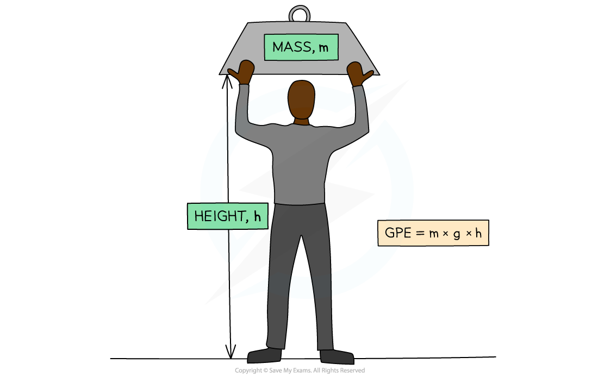
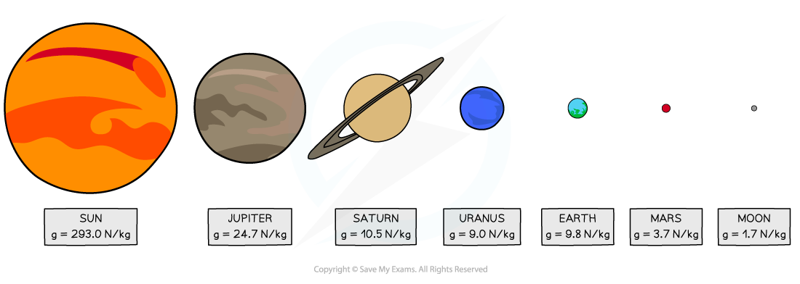
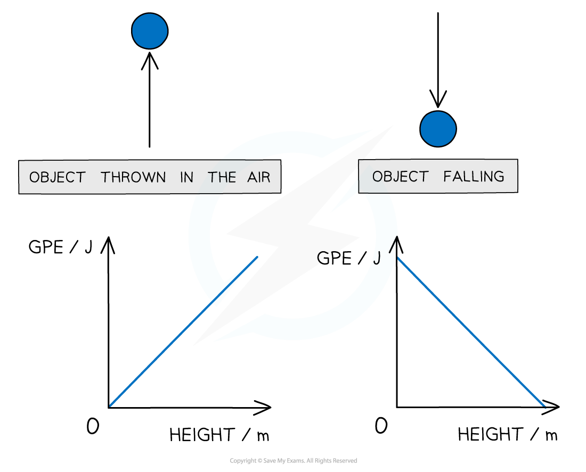

# Gravitational Potential Energy

## Gravitational potential energy

> **Spec point** — `spcpt_4xQJSF4z4bs56N8B` · know and use the relationship between gravitational potential energy, mass, gravitational field strength and height: 
gravitational potential energy = mass × gravitational field strength × height GPE = m × g × h

## Gravitational potential energy

- Energy in the gravitational potential store of an object is defined as:

**The energy an object has due to its height in a gravitational field**

- This means:

  - If an object is lifted up, energy will be transferred **to** its gravitational store
  - If an object falls, energy will be transferred **away from** its gravitational store

### The gravitational potential energy equation

- The amount of energy in the gravitational potential store of an object can be calculated using the gravitational potential energy equation:

$GPE=m\timesg\timesh$

- Where:

  - GPE = gravitational potential energy, in joules (J)
  - *m* = mass, in kilograms (kg)
  - *g* = gravitational field strength in newtons per kilogram (N/kg)
  - *h* = height in metres (m)

#### The gravitational potential energy equation applied to a person lifting a mass

***Energy is transferred to the mass's gravitational store as it is lifted above the ground***

#### Gravitational field strength

- The gravitational field strength (*g*) on the **Earth** is approximately 10 N/kg
- The gravitational field strength on the surface of the **Moon** is **less** than on the Earth

  - This means it would be **easier** to lift a mass on the Moon than on the Earth
- The gravitational field strength on the surface of the gas giants (eg. Jupiter and Saturn) is **more** than on the Earth

  - This means it would be **harder** to lift a mass on the gas giants than on the Earth

***Some values for g on the different objects in the Solar System***

- The two graphs below show how GPE changes with height for a ball being thrown up in the air and when falling down

***Graphs showing the linear relationship between GPE and height***

> **Worked Example**
> A man of mass 70 kg climbs a flight of stairs that is 3 m higher than the floor.
> 
> Gravitational field strength is approximately 10 N/kg.
> 
> Calculate the increase in energy transferred to his gravitational potential store.
> 
> **Answer: **
> 
> **Step 1: List the known quantities**
> 
> - Mass of the man, *m* = 70 kg
> - Gravitational field strength, *g* = 10 N/kg
> - Height, *h* = 3 m
> 
> **Step 2: Write down the gravitational potential energy equation**
> 
> $GPE=m\timesg\timesh$
> 
> **Step 3: Calculate the gravitational potential energy**
> 
> $GPE=70\times10\times3$
> 
> $GPE=2100J$
> 
> 
> 
> ** **

> **Exam Hint**
> When doing calculations involving gravitational field strength, *g*, don't panic, you will **always** be told the value of *g* in your equation sheet in your exam!
