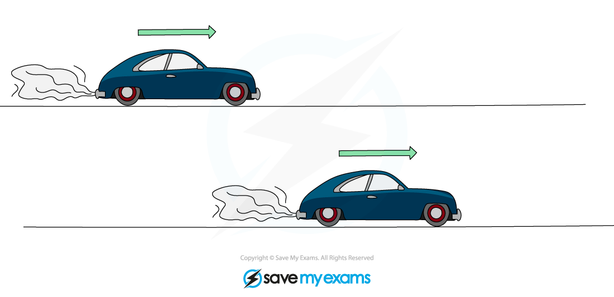
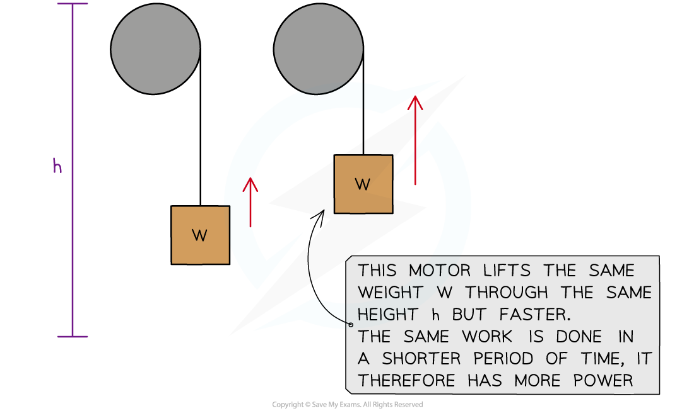
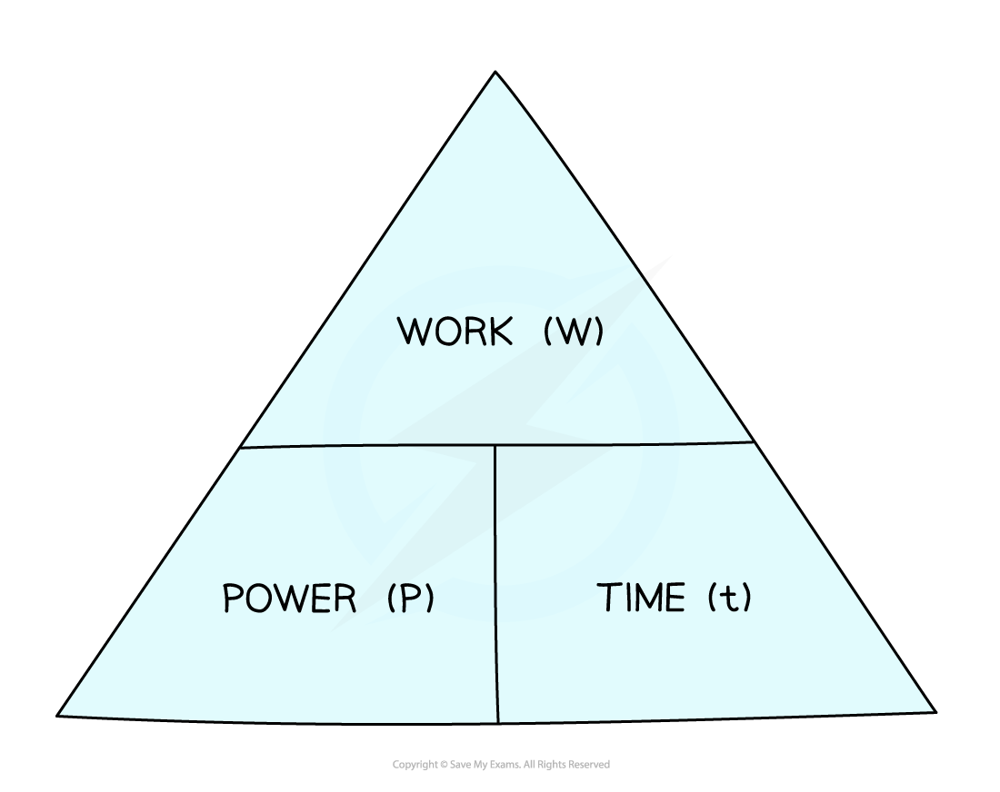

# Power

## Power

> **Spec point** — `spcpt_GpJ8vYTBGGgDtPmH` · describe power as the rate of transfer of energy or the rate of doing work

## Power

- **Power **is **work done** per unit **time**
- Since work done is equal to energy transferred, **power **is also **energy transferred** per unit **time**

- Machines, such as car engines, transfer energy from one energy store to another constantly over a period of **time**

  - The **rate **of this energy transfer, or the rate of work done, is **power**

- **Time **is an important consideration when it comes to **power**
- Two cars transfer the **same amount of energy**, or do the **same amount of work **to accelerate over a distance
- If one car has **more power**, it will transfer that energy, or do that work, in a **shorter amount of time**

#### Two cars with different power ratings doing the same amount of work

***Two cars accelerate to the same final speed, but the one with the most power will reach that speed sooner. ***

- Two electric motors:

  - lift the same weight
  - by the same height
  - but one motor lifts it **faster** than the other
- The motor that lifts the weight faster has more **power**

***Two motors with different powers***

### Power ratings

- **Power ratings** are given to appliances to show the amount of energy transferred per unit time
- Common power ratings are shown in the table below:

#### Power ratings table

| **Appliance** | **Power rating** |
|---|---|
| A torch | 1 W |
| An electric light bulb | 100 W |
| An electric oven | 10 000 W = 10 kW |
| A train | 1 000 000 W = 1 MW |
| Saturn V space rocket | 100 MW |
| Large power station | 10 000 MW |
| Global power demand | 100 000 000 MW |
| A star like the Sun | 100 000 000 000 000 000 000 MW |

- 1 kW = 1000 W (1 kilowatt = 1000 watts)
- 1 MW = 1 000 000 W (1 megawatt = 1 million watts)

## Calculating power

> **Spec point** — `spcpt_s7B7MvZWHzQc9Pfx` · use the relationship between power, work done (energy transferred) and time taken:
power = work done / time taken
P = W / T

## Calculating power

- Since power is defined as

**The rate of doing work**

- And work is

**Work done = energy transferred **

- Then, power can be expressed in equation form as

$P=\frac{W}{t}$

- Where:

  - *W* = The work done, measured in **joules** (J) or **newton-metres** (Nm)
  - *t* = time measured in seconds (s)
  - *P* = power measured in **watts** (W)

#### Power, work done and time formula triangle

***The formula triangle can be used to rearrange the equation***

- For a reminder on how to use formula triangles, see the revision note on [Speed](https://www.savemyexams.com/igcse/science/edexcel/double-award-modular/24/physics-unit-1/revision-notes/forces-motion/movement-position/speed/)

> **Worked Example**
> Calculate the work done if an iron of power 2000 W is used for 5 minutes.
> 
> **Answer:**
> 
> **Step 1: List the known values**
> 
> - Power, *P* = 2000 W
> - Time, *t* = 5 minutes = 5 × 60 = 300 s
> 
> **Step 2: Write down the relevant equation **
> 
> $P=\frac{W}{t}$
> 
> **Step 3: Rearrange for energy transferred, Δ*****E***
> 
> $W=Pt$
> 
> **Step 4: Substitute in the known values**
> 
> $W=2000\times300$
> 
> $W=600000J$

> **Exam Hint**
> Think of power as “energy per second”. Thinking of it this way will help you remember the relationship between power and energy.
