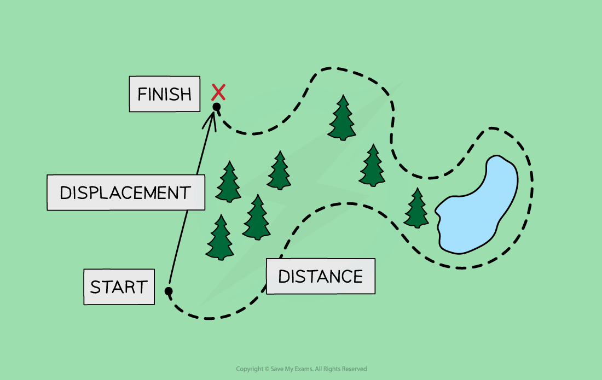
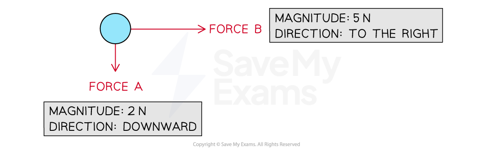

# Scalar & Vectors

## Scalar & vector quantities

> **Spec point** — `spcpt_4wrkxXHVjBtXdQsN` · understand how vector quantities differ from scalar quantities

## Scalar & vector quantities

- All quantities can be one of two types:

  - a **scalar**
  - a **vector**

### Scalars

- Scalars are quantities that have ***magnitude*** but not direction

  - For example, **mass** is a **scalar **quantity because it has **magnitude **but no direction

### Vectors

- Vectors are quantities that have both **magnitude** and **direction**

  - For example, **weight **is a **vector **quantity because it is a force and has **both **magnitude and direction

### Distance and displacement

- **Distance **is a measure of how far an object has travelled, **regardless of direction**

  - Distance is the total length of the path taken
  - Distance, therefore, has a **magnitude **but **no direction**
  - So, distance is a **scalar **quantity

- **Displacement **is a measure of how far it is between two points in space, **including the direction**

  - Displacement is the **length **and **direction** of a **straight line** drawn from the starting point to the finishing point
  - Displacement, therefore, has a **magnitude **and a **direction**
  - So, displacement is a **vector **quantity

#### What is the difference between distance and displacement?

***Displacement is a vector quantity while distance is a scalar quantity***

- When a student travels to school, there will probably be a **difference **in the distance they travel and their displacement

  - The **overall distance** they travel includes the total lengths of all the roads, including any twists and turns
  - The **overall displacement **of the student would be a straight line between their home and school, regardless of any obstacles, such as buildings, lakes or motorways, along the way

### Speed and velocity

- **Speed **is a measure of the **distance **travelled by an object per unit time, **regardless of the direction**

  - The speed of an object describes how fast it is moving, but **not **the direction it is travelling in
  - Speed, therefore, has **magnitude **but **no direction**
  - So, speed is a **scalar **quantity

- **Velocity **is a measure of the **displacement **of an object per unit time,** including the direction**

  - The velocity of an object describes how fast it is moving **and **which direction it is travelling in
  - An object can have a **constant speed** but a **changing velocity** if the object is **changing direction**
  - Velocity, therefore, has **magnitude and direction**
  - So, velocity is a **vector **quantity

### Examples of scalars & vectors

- The table below lists some common examples of scalar and vector quantities
- Corresponding vectors and their scalar counterparts are aligned in the table where applicable

#### Table of scalars and vectors

| **Scalar** | **Vector** |
|---|---|
| distance | displacement |
| speed | velocity |
| mass | weight |
|   | force |
|   | acceleration |
|   | momentum |
| energy |   |
| volume |   |
| density |   |
| temperature |   |
| power |   |

> **Worked Example**
> Astronaut A is in charge of training junior astronauts. For one of their sessions, they would like to explain the difference between mass and weight.
> 
> Suggest how Astronaut A should explain the difference between mass and weight, using definitions of scalars and vectors in your answer.
> 
> **Answer:**
> 
> **Step 1: Recall the definitions of a scalar and vector quantity**
> 
> - Scalar quantities have only a **magnitude**
> - Vector quantities have both **magnitude and direction**
> 
> **Step 2: Identify which quantity has magnitude only**
> 
> - ***Mass*** is a quantity with **magnitude** only
> - So mass is a **scalar** quantity
> 
>   - Astronaut A might explain to the junior astronauts that their mass will not change if they travel to outer space
> 
> **Step 3: Identify which quantity has magnitude and direction**
> 
> - ***Weight*** is a quantity with **magnitude and direction** (it is a force)
> - So weight is a **vector** quantity
> 
>   - Astronaut A might explain to the junior astronauts that their weight will vary depending on their location in space

## Forces as vectors

> **Spec point** — `spcpt_Dvm4b2wghdgCX6yT` · understand that force is a vector quantity

## Forces as vectors

- **Vector **quantities can be represented by arrows

  - The **length** of the arrow represents the **magnitude**
  - The **direction** of the arrow indicates the **direction **
- **Force **is a **vector **quantity because force has **magnitude and direction**
- When using arrows to represent forces:

  - the **length **of the arrow represents the **magnitude **of the force
  - the **direction **of the arrow indicates the **direction **of the force
  - the **scale **of the arrows should be **proportional **to the relative magnitudes of the forces
  
    - an arrow for a 4 N force should be twice as long as an arrow for a 2 N force
  - the arrows should be labelled with the names of the forces, or a description of the forces
  
    - for example, weight, W, or the gravitational pull of the Earth on the object

#### Two forces acting on an object

***The length of the arrows are proportional to the magnitude of the forces, and show the direction that forces act in***

- Not all forces are directed perfectly horizontally or vertically and so need to have an angle described for the direction

  - It is useful to describe an angle with respect to the vertical or the horizontal

#### A force acting at an angle

***A force of magnitude 100 N directed 40° from the horizontal***
