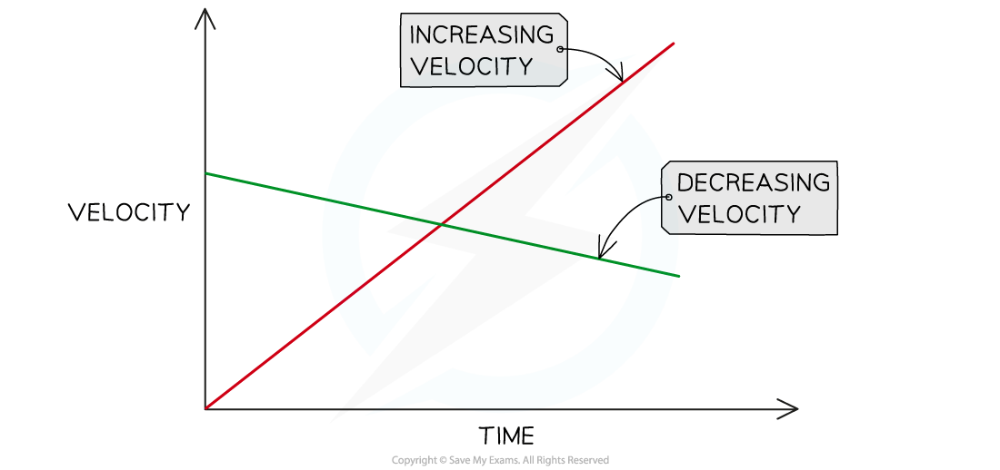
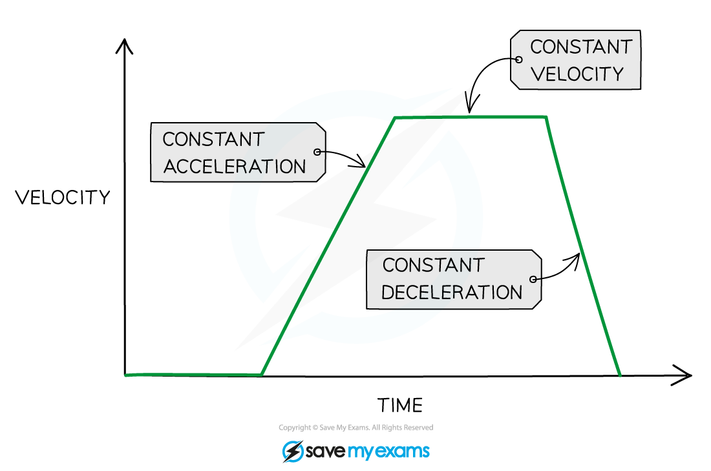
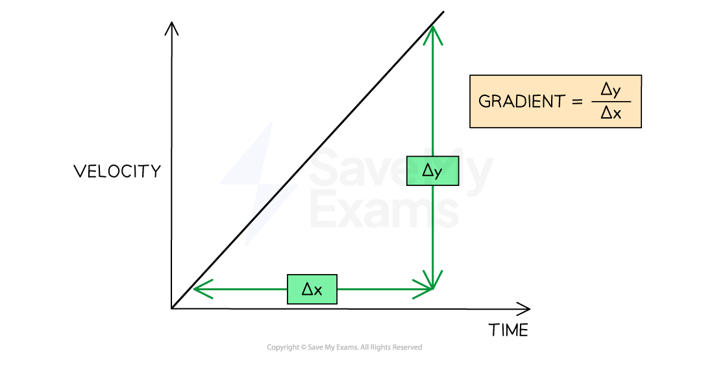

# Velocity-Time Graphs

## Velocity-time graphs

> **Spec point** — `spcpt_PHhGBcx5sybJVMTP` · plot and explain velocity-time graphs

## Velocity-time graphs

- A velocity time graph, or velocity-time graph, shows how the **velocity** of a moving object varies with **time**

  - Velocity-time refers to the fact that velocity is plotted against time on the graph
- The red line represents an object with **increasing** velocity
- The green line represents an object with **decreasing** velocity

#### Velocity-time graph

***Increasing and decreasing velocity represented on a velocity-time graph***

### Acceleration on a velocity-time graph

- Velocity-time graphs also show the following information:

  - Whether the object is moving with a **constant acceleration**
  - The **magnitude** of the acceleration

- A **straight line** represents **constant acceleration **(or deceleration)
- The **slope** of the line represents the **magnitude** of acceleration

  - A **steep** slope means **large** **acceleration**
  
    - The object's speed changes very **quickly**
  - A **gentle** slope means **small** **acceleration**
  
    - The object's speed changes very **gradually**
  - A** positive gradient **shows** increasing velocity**
  
    - The object is **accelerating**
  - A **negative gradient **shows **decreasing velocity**
  
    - The object is** decelerating**
  - A **flat line** means the acceleration is **zero**
  
    - The object is moving with a **constant velocity**

** **

#### Constant acceleration and constant velocity on a velocity-time graph

***Flat horizontal lines on a velocity-time graph show periods of constant velocity, and sloping straight lines show periods of acceleration***

## Gradient of a velocity-time graph

> **Spec point** — `spcpt_Gbc5XFr3bYrPWmX5` · determine acceleration from the gradient of a velocity−time graph

## Gradient of a velocity-time graph

### How to find acceleration on a velocity-time graph

- The **acceleration** of an object can be calculated from the **gradient** of a velocity-time graph

$\mathrm{acceleration}=\mathrm{gradient}=\frac{\Deltay}{\Deltax}$

***How to find the gradient of a velocity-time graph***

- $\Deltay$ is the change in $y$ (velocity) values
- $\Deltax$ is the change in $x$ (time) values

> **Worked Example**
> A cyclist is training for a cycling tournament.
> 
> The velocity-time graph below shows the cyclist's motion as they cycle along a flat, straight road.
> 
> 
> 
> (a) In which section (A, B, C, D, or E) of the velocity-time graph is the cyclist's acceleration the largest?
> 
> (b) Calculate the cyclist's acceleration between 5 and 10 seconds.
> 
> **Answer:**
> 
> **Part (a)**
> 
> **Step 1:** **Recall that the slope of a velocity-time graph represents the magnitude of acceleration**
> 
> - The slope of a velocity-time graph indicates the magnitude of acceleration Therefore, the only sections of the graph where the cyclist is accelerating are sections B and D
> - Sections A, C, and E are flat; in other words, the cyclist is moving at a constant velocity (therefore, not accelerating)
> 
> **Step 2: Identify the section with the steepest slope**
> 
> - Section D of the graph has the steepest slope
> - Hence, the largest acceleration is shown in section D
> 
> **Part (b)**
> 
> **Step 1: Recall that the gradient of a velocity-time graph gives the acceleration**
> 
> - Calculating the gradient of a slope on a velocity-time graph gives the acceleration for that time period
> 
> **Step 2: Draw a large gradient triangle at the appropriate section of the graph**
> 
> - A gradient triangle is drawn for the time period between 5 and 10 seconds
> 
> 
> 
> **Step 3: Calculate the size of the gradient and state this as the acceleration**
> 
> - The acceleration is given by the gradient, which can be calculated using:
> 
> $a=\frac{\Deltay}{\Deltax}$
> 
> $a=\frac{5}{5}$
> 
> $a=1m/s^{2}$
> 
> - Therefore, the cyclist accelerated at 1 m/s2 between 5 and 10 seconds

> **Exam Hint**
> Use the **entire slope**, where possible, to calculate the gradient. Examiners tend to award credit if they see a **large gradient triangle** used.
> 
> Remember to actually draw the lines directly on the graph itself, particularly when the question asks you to **use the graph** to calculate the acceleration.
