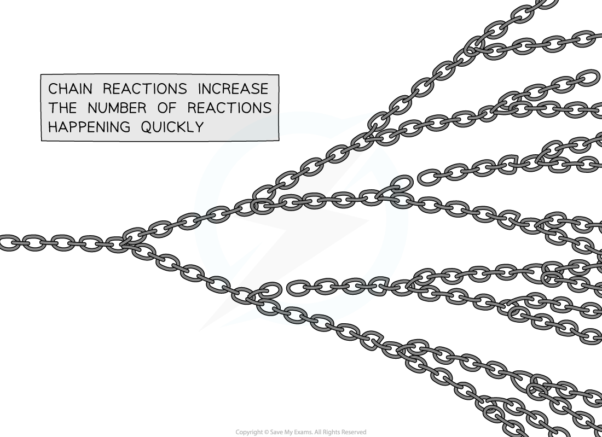
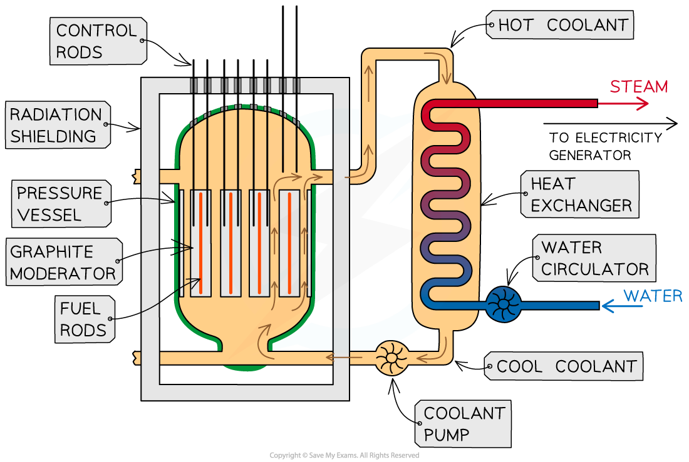
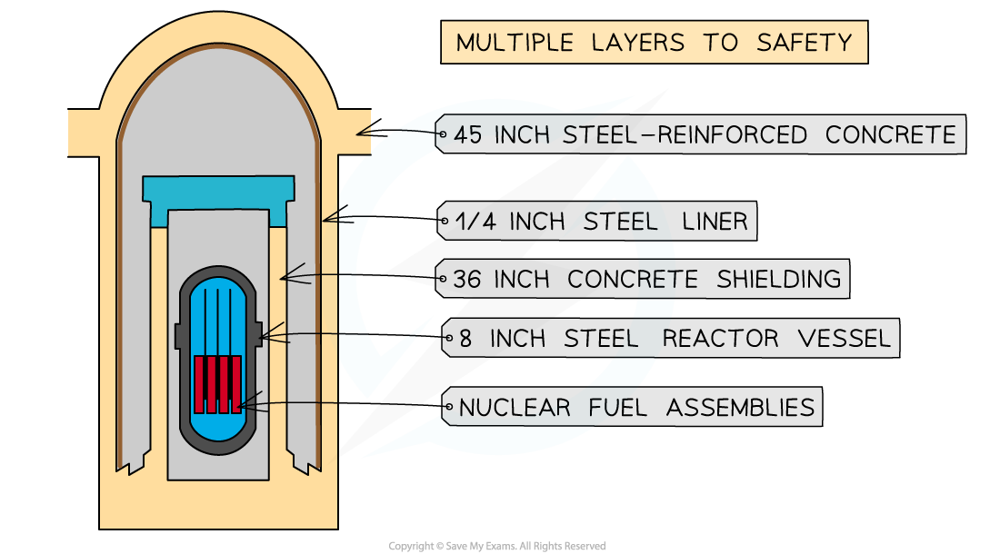

# Nuclear Reactors

## Chain reactions

> **Spec point** — `spcpt_ZYrty2Br6r3hRWgs` · describe how a chain reaction can be set up if the neutrons produced by one fission strike other U-235 nuclei

## Chain reactions

- Only one extra neutron is required to induce fission in a uranium-235 nucleus
- During the fission, it produces **two** or **three** neutrons which move away at high speed
- Each of these new neutrons can start another fission reaction, which again emits further **neutrons**

  - This process can start a **chain reaction**

- A chain reaction occurs when

**A neutron emitted from the splitting of a nucleus causes further nuclei to split and the neutrons emitted from these cause further fission reactions**

- Controlling chain reactions is an important part of the fission process in nuclear reactors
- For a chain reaction to be maintained, there must be a minimum amount of fissile material called the **critical mass**

  - If the mass of fissile material exceeds the critical mass, the rate of reaction accelerates
  - This can cause a huge and uncontrolled release of energy, i.e. a nuclear explosion

***The neutrons released by each fission reaction can go on to create further fissions, like a chain that is linked several times – from each chain comes two more***

> **Worked Example**
> The diagram shows the nuclear fission process for an atom of uranium-235.
> 
> 
> 
> Complete the diagram to show how the fission process starts a chain reaction.
> 
> **Answer:**
> 
> **Step 1: Draw the neutrons to show that they hit other U-235 nuclei**
> 
> - It is the neutrons hitting the uranium-235 nuclei which causes the fission reactions
> - The daughter nuclei do not need to be shown, only the neutrons and uranium-235 nuclei
> 
> **Step 2: Draw the splitting of the U-235 nuclei to show they produce two or more neutrons**
> 
> - The number of neutrons increases with each fission reaction
> - Each reaction requires one neutron but releases two
> - More reactions happen as the number of neutrons increases
> 
> 

> **Exam Hint**
> You need to be able to draw and interpret different diagrams of nuclear fission and chain reactions. Generally, things move to the right as time goes on in these diagrams, but it is important to read all the information carefully on questions like this.
> 
> If you have to draw a diagram in an exam remember that the **clarity** of the information is important, not how pretty it looks!

## Control rods & moderators

> **Spec point** — `spcpt_y37RwfZzYR6ZP7gs` · describe the role played by the control rods and moderator in the fission process

## Control rods & moderators

- In a nuclear reactor, a chain reaction is required to keep the reactor running
- When the reactor is producing energy at the required rate, two factors must be controlled:

  - The** number** of free neutrons in the reactor
  - The** energy **of the free neutrons

- The main components of a nuclear reactor are:

  - control rods
  - a moderator

#### Nuclear reactor diagram

***The overall purpose of the reactor is to control chain reactions and collect the heat energy produced from nuclear reactions to generate electricity***

### Control rods

**Purpose of control rods: **To absorb neutrons

- Control rods are made of a material which absorbs neutrons without becoming dangerously unstable themselves
- The number of neutrons absorbed is controlled by varying the depth of the control rods in the reactor core

  - Lowering the rods further **decreases** the rate of fission, as more neutrons are absorbed
  - Raising the rods **increases** the rate of fission, as fewer neutrons are absorbed

- This is adjusted automatically so that exactly one fission neutron produced by each fission event goes on to cause another fission
- In the event the nuclear reactor needs to shut down, the control rods can be lowered all the way so no reactions can take place

### Moderator

**Purpose of a moderator:** To slow down neutrons

- The moderator is a material that surrounds the fuel rods and control rods inside the reactor core
- The fast-moving neutrons produced by the fission reactions slow down by colliding with the molecules of the moderator, causing them to lose some momentum
- The neutrons are slowed down so that they are in **thermal equilibrium **with the moderator

  - These neutrons are called **thermal neutrons**
  - This ensures neutrons can react efficiently with the uranium fuel

## Shielding

> **Spec point** — `spcpt_PNw7jSDkD5jZZR5S` · understand the role of shielding around a nuclear reactor

## Shielding

**Purpose of shielding:** To absorb hazardous radiation

- The entire nuclear reactor is surrounded by **shielding** materials
- The daughter nuclei formed during fission, and the neutrons emitted, are radioactive
- The reactor is surrounded by a **steel** and **concrete** wall that can be nearly 2 metres thick
- This absorbs the emissions from the reactions and ensures that the environment around the reactor is **safe** for workers

***Shielding materials around a nuclear reactor are designed to absorb harmful radiation***
