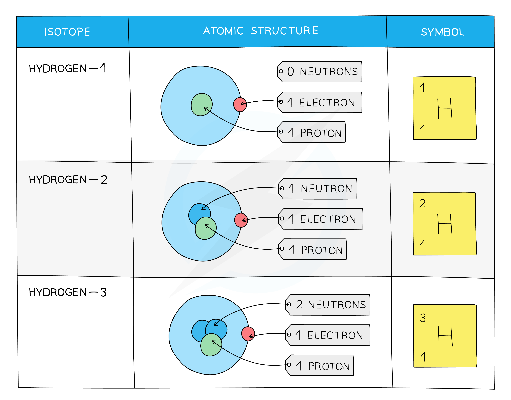

# Isotopes

## Isotopes

> **Spec point** — `spcpt_HwkdXczJ8tDjNjH2` · know the term isotope

## Isotopes

- For a particular element, the number of protons is always the same, but the number of **neutrons** can be different

  - This is because the number of protons determines the element e.g. carbon atoms have 6 protons and iron atoms have 26 protons

- An isotope is defined as:

**An atom, or atoms, of the same element that have an equal number of protons but a different number of neutrons**

- Each element can have more than one isotope

#### Isotopes of hydrogen

- Some isotopes are more **unstable** than others due to the imbalance of protons and neutrons, which means

  - They may be more likely to decay
  - They may be less likely to occur naturally

- For example, about 2 in every 10 000 atoms of hydrogen are the isotope deuterium

  - The isotope tritium is even rarer (about 1 in every billion billion atoms of hydrogen)

> **Worked Example**
> State the number of protons, neutrons and electrons in these two isotopes of chlorine:
> 
> `Cl presubscript 17 presuperscript 35`,  `Cl presubscript 17 presuperscript 37`
> 
> **Answer:**
> 
> **Step 1: Determine the number of protons**
> 
> - The atomic number is the number of protons
> - Both chlorine-35 and chlorine-37 have 17 protons
> 
> **Step 2: Determine the number of neutrons**
> 
> - The mass number is the number of protons and neutrons
> - Number of neutrons in chlorine-35 = 35 − 17 = 18
> - Number of neutrons in chlorine-37 = 37 − 17 = 20
> 
> **Step 3: Determine the number of electrons**
> 
> - The number of electrons is equal to the number of protons
> - Both chlorine-35 and chlorine-37 have 17 electrons
