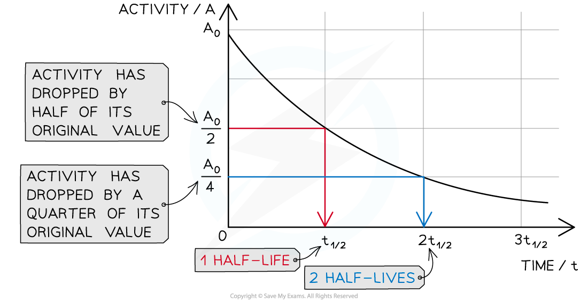

# Half-Life

## Half life

> **Spec point** — `spcpt_dBhXphBvfbYPqbJJ` · know the definition of the term half-life and understand that it is different for different radioactive isotopes

## Half life

- It is impossible to know when a particular unstable nucleus will decay
- It is possible to find out the rate at which the activity of a sample decreases

  - This is known as the **half-life**

- Half-life is defined as:

**The time it takes for the number of nuclei of a sample of radioactive isotopes to decrease by half**

- In other words, the time it takes for the activity of a sample to fall to half its original level
- Different isotopes have different half-lives and half-lives can vary from a fraction of a second to billions of years in length

### Measuring half life

- To determine the half-life of a sample, the procedure is:

  - Measure the initial activity *A**0* of the sample
  - Determine the half-life of this original activity
  - Measure how the activity changes with time

- The time taken for the activity to decrease to half its original value is the **half-life**

## Calculating half-life

> **Spec point** — `spcpt_GRrqM2RpTh3wgGVN` · use the concept of the half-life to carry out simple calculations on activity, including graphical methods

## Calculating half-life

- Scientists can measure the half-lives of different isotopes accurately
- Uranium-235 has a half-life of 704 million years

  - This means it would take 704 million years for the activity of a uranium-235 sample to decrease to half its original amount

- Carbon-14 has a half-life of 5700 years

  - So after 5700 years, there would be 50% of the original amount of carbon-14 remaining
  - After two half-lives or 11 400 years, there would be just 25% of the carbon-14 remaining

- With each half-life, the amount remaining **decreases by half**

#### A graph can be used to make half-life calculations

***The graph shows how the activity of a radioactive sample changes over time. Each time the original activity halves, another half-life has passed***

- The time it takes for the activity of the sample to decrease from 100% to 50% is the half-life
- It is the same length of time as it would take to decrease from 50% activity to 25% activity
- The half-life is **constant** for a particular isotope

- The following table shows that as the number of half-life increases, the proportion of the isotope remaining **halves**

#### Half life calculation table

| **number of half lives** | **proportion of isotope remaining** |
|---|---|
| 0 | $1$ or 100% |
| 1 | $\frac{1}{2}$ or 50% |
| 2 | $\frac{1}{4}$ or 25% |
| 3 | $\frac{1}{8}$ or 12.5% |
| 4 | $\frac{1}{16}$ or 6.25% |

> **Worked Example**
> The activity of a particular radioactive sample is 880 Bq. After a year, the activity has dropped to 220 Bq.
> 
> What is the half-life of this material?
> 
> **Answer:**
> 
> **Step 1: Calculate how many times the activity has halved**
> 
> - Initially, the activity was 880 Bq
> - After 1 half-life the activity would be 440 Bq
> - After 2 half-lives, the activity would be 220 Bq
> - Therefore, 2 half-lives have passed
> 
> **Step 2: Divide the time period by the number of half-lives**
> 
> - The time period is a year
> - The number of half-lives is 2
> 
> `880 space rightwards arrow from 6 space months to 1 space half space life of space 440 space rightwards arrow from 1 space year to 2 space half space lives of space 220`
> 
> - So two half-lives is 1 year, and one half-life is 6 months
> - Therefore, the half-life of the sample is **6 months**

> **Worked Example**
> The radioisotope technetium is used extensively in medicine. The graph below shows how the activity of a sample varies with time.
> 
> 
> 
> Determine the half-life of this material.
> 
> **Answer:**
> 
> **Step 1: Draw lines on the graph to determine the time it takes for technetium to drop to half of its original activity**
> 
> 
> 
> **Step 2: Read the half-life from the graph**
> 
> - In the diagram above the initial activity, *A**0*, is 8 × 107 Bq
> - The time taken to decrease to 4 × 107 Bq, or ½ *A**0*, is 6 hours
> - Therefore, the half-life of this isotope is **6 hours**
