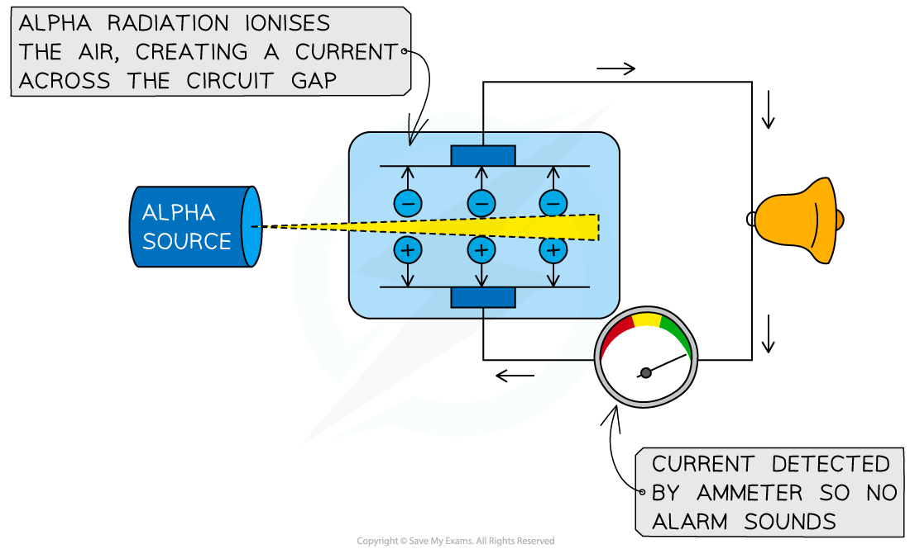
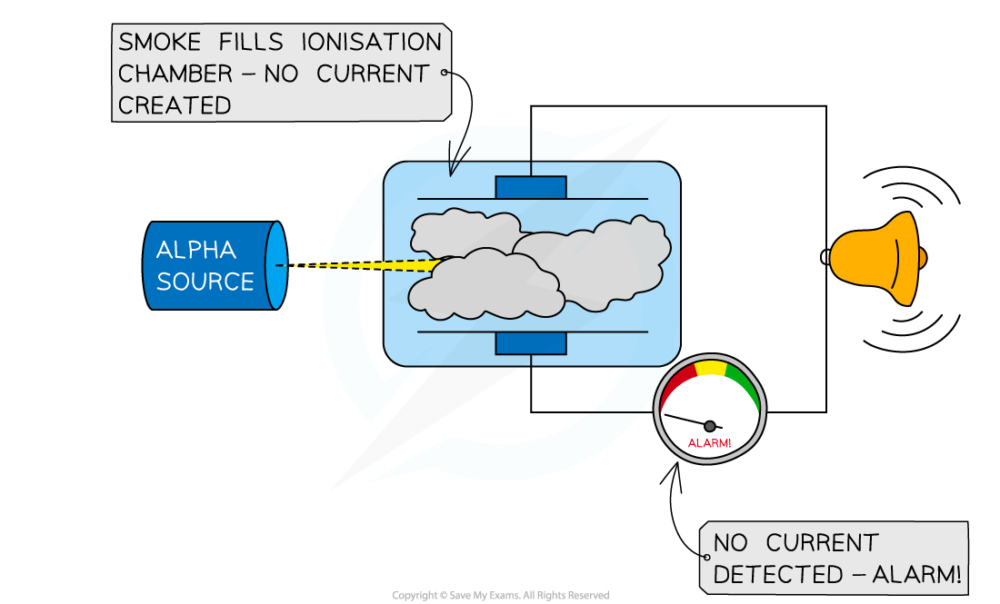
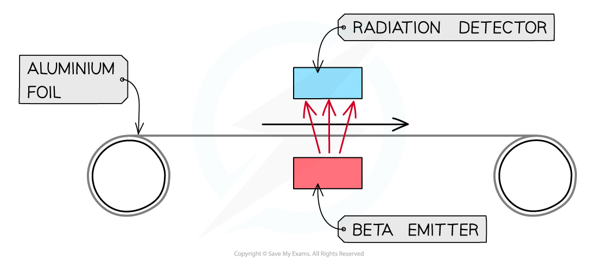
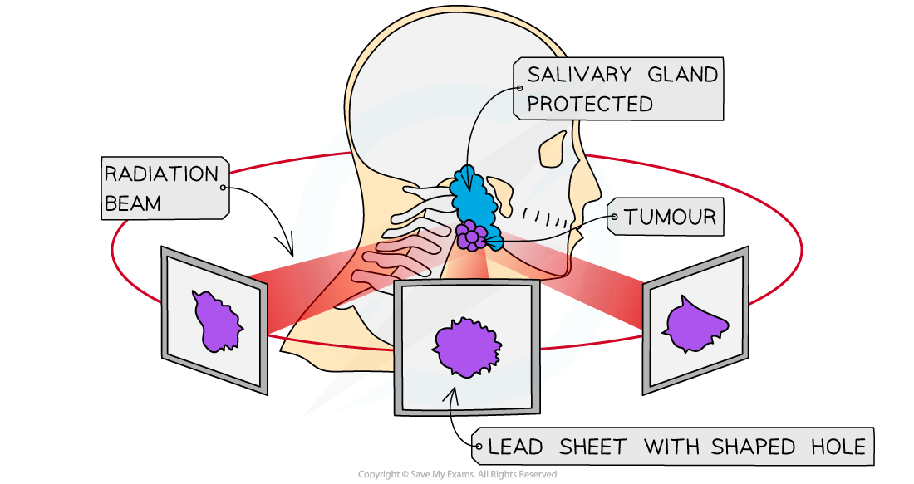

# Uses of Radioactivity

## Uses of radioactivity

> **Spec point** — `spcpt_nQP3FR7WskG2YhJt` · describe uses of radioactivity in industry and medicine

## Uses of radioactivity

- Radioactivity has many uses, such as:

  - Smoke detectors (alarms)
  - Monitoring the thickness of materials
  - Medical procedures including diagnosis and treatment of cancer
  - Sterilising food (irradiating food)
  - Sterilising medical equipment
  - Determining the age of ancient artefacts

- The properties of the different types of radiation determine which one is used in a particular application

### Smoke detectors

- Alpha particles are used in smoke detectors
- The alpha radiation will normally **ionise** the air within the detector, creating a current
- The alpha emitter is blocked when smoke enters the detector
- The alarm is triggered by a microchip when the sensor no longer detects alpha

***When no smoke is present, alpha particles ionise the air and cause a current to flow. When smoke is present, alpha particles are absorbed and current is prevented from flowing which triggers the alarm***

### Measuring the thickness of materials

- When a material, such as aluminium foil, moves above a beta source, some beta particles will be absorbed, but most will penetrate

  - The amount of beta particles passing through the material can be monitored using a detector

- If the material gets **thicker**, more particles will be absorbed, and the count rate will **decrease**
- If the material gets **thinner**, fewer particles will be absorbed, and the count rate will **increase**
- This allows the manufacturer to make adjustments to keep the thickness of the material constant

***Beta particles can be used to measure the thickness of thin materials such as paper, cardboard or aluminium foil***

- Beta radiation is used because the material will only **partially **absorb it

  - If an **alpha** source were used, **all **alpha particles would be **absorbed **regardless of material thickness
  - If a **gamma** source were used, almost **all **gamma rays would be **detected **regardless of material thickness

### Diagnosis and treatment of cancer

- Radiotherapy is the name given to the treatment of cancer using radiation

  - **Note**: this is different to chemotherapy which is a drug treatment for cancer

- Although radiation can cause cancer, it is also highly effective at treating it
- Ionising radiation can kill living cells

  - Some cells, such as bacteria and cancer cells, are more susceptible to radiation than others

- Beams of gamma rays are directed at the cancerous tumour

  - Gamma rays are used as they can penetrate the body and reach the tumour
  - The beams are moved around to minimise harm to healthy tissue whilst still being aimed at the tumour

- A **tracer** is a radioactive isotope that can be used to track the movement of substances, like blood, around the body
- A PET scan can detect the emissions from a tracer to diagnose cancer and determine the location of a tumour

***Radiation therapy is a type of cancer treatment which targets the tumour with ionising radiation***

### Sterilising food and medical equipment

- Gamma radiation is widely used to **sterilise** medical equipment
- Gamma is most suited to this because:

  - It is the most **penetrating** out of all the types of radiation
  - It is penetrating enough to irradiate **all sides** of the instruments
  - Instruments can be sterilised without removing the **packaging**

- Food can be irradiated in order to** kill any microorganisms **that are present on it
- This makes the food last longer and reduces the risk of food-borne infections

***Food that has been irradiated carries this symbol, called the Radura. Different countries allow different foods to be irradiated***

> **Worked Example**
> Explain why a source of alpha radiation is used in smoke detectors, and not beta or gamma radiation.
> 
> **Answer:**
> 
> **Step 1: Consider the different properties of alpha, beta and gamma radiation**
> 
> - Alpha is the most weakly penetrating and strongest ioniser
> - Beta and gamma have stronger penetrating power and weaker ionising power
> 
> **Step 2: Explain why alpha radiation is the best choice for use in a smoke detector**
> 
> - Alpha radiation is the most suitable as it would be easily absorbed by the smoke and trigger the alarm
> - Beta and gamma radiation are not suitable as they would pass straight through the smoke and the alarm would not be triggered

> **Exam Hint**
> If you are presented with an unfamiliar situation in your exam don’t panic! Just apply your understanding of the properties of alpha, beta and gamma radiation. Focus on the range (how far it can travel) and ionising power of the radiation to help understand which radiation is used in which situation.
