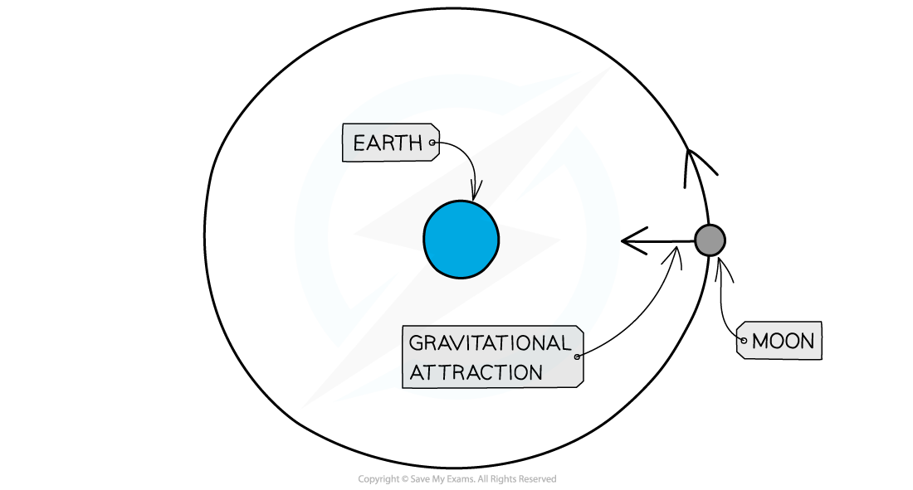
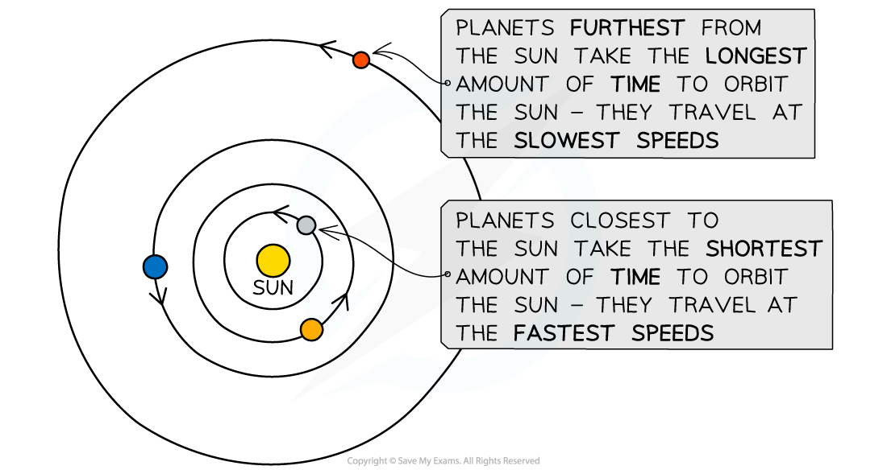
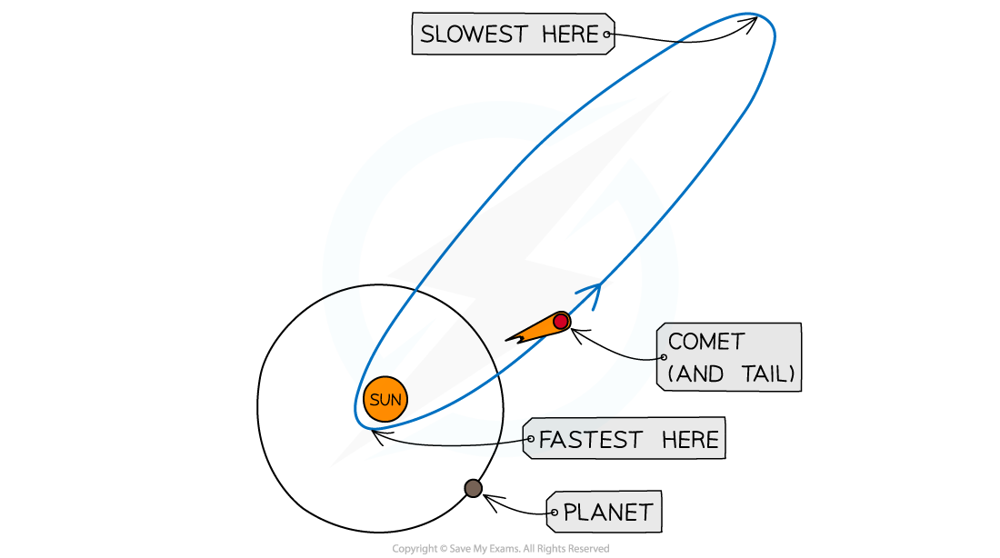

# Orbital Motion

## Orbital motion

> **Spec point** — `spcpt_bJNjcGSCgwkPd7Yb` · explain that gravitational force: 
• causes moons to orbit planets
• causes the planets to orbit the Sun
• causes artificial satellites to orbit the Earth
• causes comets to orbit the Sun.

## Orbital motion

- The Solar System is made up of many bodies which orbit around other bodies
- The orbiting bodies in the Solar System are shown in the table below:

#### Table of orbiting bodies in the Solar System

| **orbiting body** | **body it orbits** |
|---|---|
| planet | the Sun |
| moon | planet |
| comet | the Sun |
| asteroid | the Sun |
| artificial satellites | the Earth |

- **Smaller** bodies **orbit** around **larger** bodies

  - For example, planets orbit the Sun

- Orbital motion is a result of the **gravitational force of attraction **acting between two bodies
- This gravitational force

  - always acts **towards the centre** of the larger body
  - causes the orbiting body to move in a **circular path**

***The gravitational force of attraction causes the Moon to orbit around the Earth***

## Differences in orbits

> **Spec point** — `spcpt_2vvNnwbNvPQxHkr4` · describe the differences in the orbits of comets, moons and planets

## Differences in orbits

### Orbital motion of planets

- There are several **similarities** in the way different planets orbit the Sun:

  - Their orbits are all **slightly elliptical** (stretched circles) with the Sun at one focus (approximately the centre of the orbit)
  - They all orbit in the **same plane**
  - They all travel in the** same direction** around the Sun

- There are also a few differences:

  - They orbit at **different distances** from the Sun (different orbital radius)
  - They orbit at **different speeds**
  - They all take **different amounts of time** to orbit the Sun

- The **further **away a planet is from the Sun, the **slower **it travels and therefore the **longer** it takes to orbit

***The planets closest to the Sun have higher orbital speeds, whereas the planets furthest from the Sun have lower orbital speeds***

### Orbital motion of moons

- Moons orbit planets in a **circular path**
- Some planets have more than one moon
- The **closer** the moon is to the planet:

  - the **shorter** the **time** it will take to complete each orbit
  - the **greater** the **speed** of the orbit

### Orbital motion of comets

- The orbits of comets are very different to those of planets:
- Their orbits are highly **elliptical** (very stretched) or hyperbolic

  - This causes the speed of the comets to change significantly as their distance from the Sun changes
  - Not all comets orbit in the same plane as the planets and some don’t even orbit in the same direction

- As the comet approaches the sun, its speed **increases**
- As it moves further away from the sun, its speed **decreases**

***Comets follow highly elliptical orbits around the Sun***
