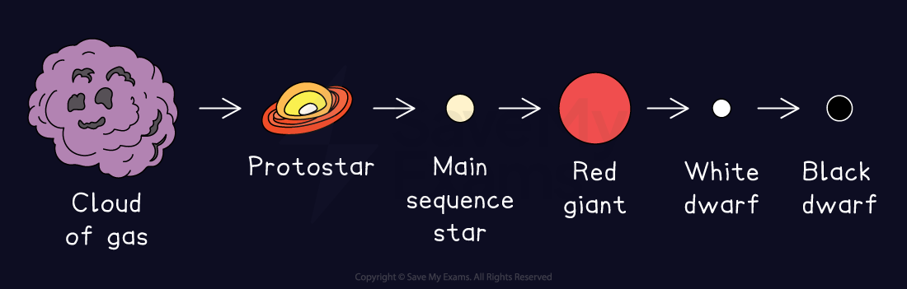

# The Life Cycle of Solar Mass Stars

## The life cycle of solar mass stars

> **Spec point** — `spcpt_cmpPWCPgPTS4FmvD` · describe the evolution of stars of similar mass to the Sun through the following stages: 
• nebula
• star (main sequence)
• red giant
• white dwarf.

## The life cycle of solar mass stars

- All stars, including the Sun, began as a cloud of dust and gas
- Once a star has formed, it will spend its life going through a sequence of evolutionary stages, known as the** life cycle** of a star

#### Summary of the life cycles of stars

*The life cycle of a star depends on whether it is similar in size to the Sun or much larger*

## Star formation

- All stars follow the same initial stages:

**nebula → protostar → main sequence star**

### Nebula

- Stars form from a giant interstellar **cloud of gas and dust **called a nebula

### Protostar

- The force of **gravity** within a nebula pulls the particles **closer together** until a hot ball of gas forms, known as a **protostar**
- As the particles are pulled closer together the **density** of the protostar will **increase**
- This results in **more frequent collisions** between the particles which causes the **temperature** to **increase**

### Main sequence star

- Once the protostar becomes hot enough, ***nuclear fusion***  reactions occur within its core
- Once a star initiates fusion, it is known as a **main sequence star**
- During the main sequence, the star is in **equilibrium **and said to be **stable**

## Evolution of a solar mass star

- After the main sequence, stars which are similar in size to the Sun go through the following evolutionary stages:

**main sequence → red giant  → white dwarf**

*The life cycle of a star that is similar to our Sun*

### Red giant

- After several **billion** years, the hydrogen causing the fusion reactions in the star will begin to run out
- Once this happens, the fusion reactions in the core will start to **die down**
- The star will begin to fuse helium which causes the outer part of the star to **expand**
- As the star expands, its surface cools and it becomes a **red giant **

### White dwarf

- Once the helium fusion reactions have finished, the star collapses and becomes a **white dwarf**
- The white dwarf **cools** down over time and as a result, the amount of **energy** it emits **decreases**

  - Once the star has lost a significant amount of energy and no longer emits light, it becomes a black dwarf

> **Exam Hint**
> Make sure you remember the life cycle for a solar mass star and ensure you can describe the sequence in a logically structured manner in case a 6 marker comes up in the exam!
> 
> Ensure you can remember the end stages for a solar mass star clearly (red giant, then white dwarf), as this is different for a star that is much larger than our Sun!
