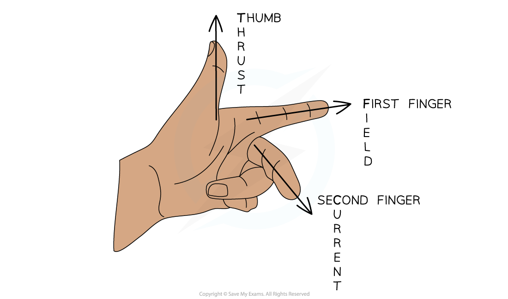

# Fleming's Left-Hand Rule

## Fleming's left-hand rule

> **Spec point** — `spcpt_V7mwmWtpFGskw5GC` · use the left-hand rule to predict the direction of the resulting force when a wire carries a current perpendicular to a magnetic field

## Fleming's left-hand rule

- The **direction** of the **force** (aka the **thrust**) on a current-carrying wire depends on the direction of

  - the current
  - the magnetic field
- All three will be **perpendicular **to each other in Fleming's left-hand rule questions

  - This means that sometimes the force could be into and out of the page (in 3D)

- The direction of the force (or thrust) can be worked out by using **Fleming's left-hand rule**:

***Fleming’s left-hand rule can be used to determine the directions of the force, magnetic field and current***

> **Worked Example**
> A current-carrying wire is placed into the magnetic field between the poles of the magnet, as shown in the diagram.
> 
> 
> 
> Use Fleming’s left-hand rule to show that there will be a downward force acting on the wire.
> 
> **Answer:**
> 
> **Step 1: Determine the direction of the magnetic field**
> 
> - Start by pointing your **F**irst **F**inger in the direction of the (magnetic) **F**ield
> 
> **Step 2: Determine the direction of the current**
> 
> - Now rotate your hand around the first finger so that the se**C**ond finger points in the direction of the **C**urrent
> 
> **Step 3: Determine the direction of the force**
> 
> - The **TH**umb will now be pointing in the direction of the **TH**rust (the force)
> - Therefore, this will be the direction in which the wire will move
> 
> 

> **Exam Hint**
> Remember that the magnetic field is always in the direction from **North **to **South**.
> 
> Feel free to use your hands when answering Fleming's left hand rule questions, just don't make it too obvious or distracting for other students!
