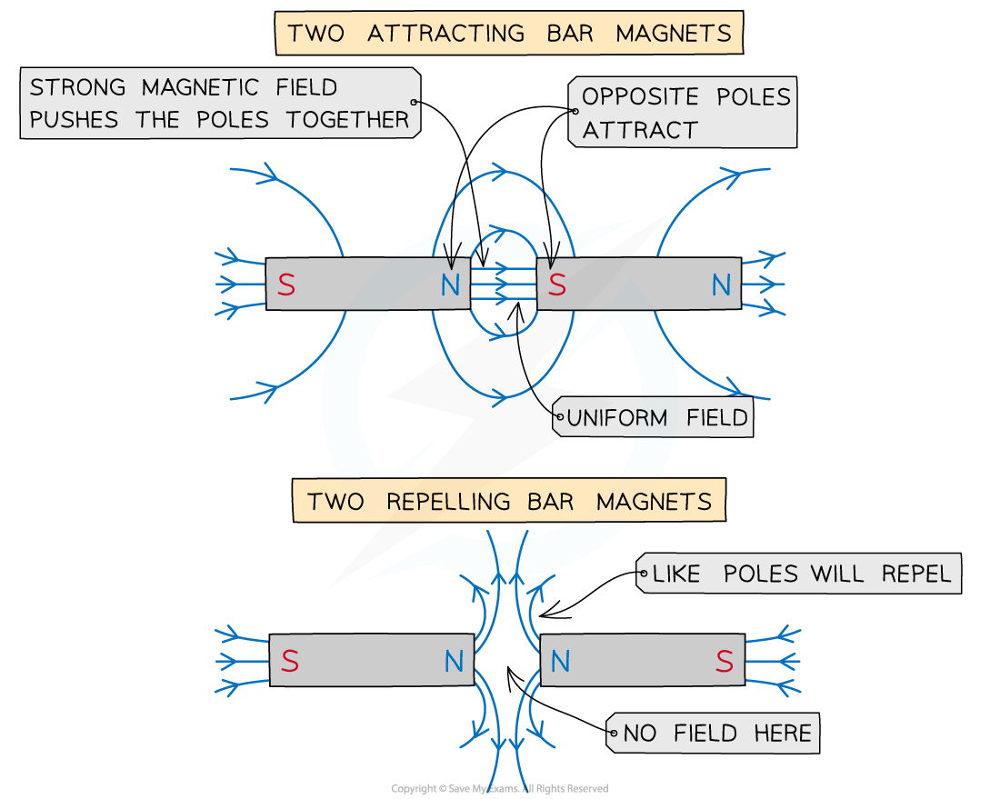

# Magnetic Fields

## Magnetic field lines

> **Spec point** — `spcpt_D8vmRZmV4Hv7mqrV` · understand the term magnetic field line

## Magnetic field lines

- All magnets are surrounded by a **magnetic field**
- A magnetic field is defined as:

**The region around a magnet where a force acts on another magnet or on a magnetic material (such as iron, steel, cobalt and nickel)**

### Magnetic field lines

- Magnetic field lines are used to represent the **strength** and **direction** of a magnetic field
- The direction of the magnetic field is shown using **arrows**
- The **strength** of the magnetic field is shown by the **spacing** of the magnetic field lines

  - If the magnetic field lines are **close together** then the magnetic field will be **strong**
  - If the magnetic field lines are **far apart** then the magnetic field will be **weak**
- There are some rules which must be followed when drawing magnetic field lines. Magnetic field lines:

  - Always go **from north to south** (indicated by an arrow midway along the line)
  - two magnetic field lines must **never touch or cross** other field lines

#### Magnetic field around a bar magnet

- The magnetic field is **strongest at the poles**

  - This is where the magnetic field lines are **closest** together
- The magnetic field becomes **weaker as the distance from the magnet increases**
- This is shown by the magnetic field lines are getting **further apart**

***The magnetic field around a bar magnet***

- Two bar magnets can repel or attract, the field lines will look slightly different for each:

***Magnetic field lines for attracting and repelling bar magnets***

- Therefore, the magnetic field lines around different configurations of two bar magnets would look like:

***Magnetic field lines between two bar magnets***

> **Exam Hint**
> If you are asked to draw the magnetic field around a bar magnet remember to indicate both the **direction** of the magnetic field and the **strength** of the magnetic field. You can do this by:
> 
> - Adding arrows pointing away from the north pole and towards the south pole
> - Making sure the magnetic field lines are further apart as the distance from the magnet increases

## Representing magnetic fields

> **Spec point** — `spcpt_DCFM5KrMM9mCQkc7` · describe how to use two permanent magnets to produce a uniform magnetic field pattern

## Representing magnetic fields

- Two bar magnets can be used to produce a uniform magnetic field
- Point opposite poles (north and south) of the two magnets a few centimetres apart
- A **uniform** magnetic field will be produced in the **gaps** between **opposite poles**

  - Note: Outside that gap, the field will **not** be uniform

***A uniform field is created when two opposite poles are held close together. Magnetic fields are always directed from North to South. Note that the rest of each magnet is not shown, but the magnet with a north pole also has a south pole not shown and vice versa for the south pole shown above.***

- A uniform magnetic field is one that has the **same strength and direction at all points**

  - To show that the magnetic field has the same strength at all points there must be **equal spacing** between all magnetic field lines
  - To show that the magnetic field is acting in the same direction at all points there must be an arrow on each magnetic field line going from the **north** pole to the **south** pole

- The magnetic field lines are the **same distance apart** between the gaps of the poles to indicate that the field strength is the same at every point between the poles

> **Exam Hint**
> Remember that the direction of the field line at a point is the same as the direction of the force a north pole would experience at that point
