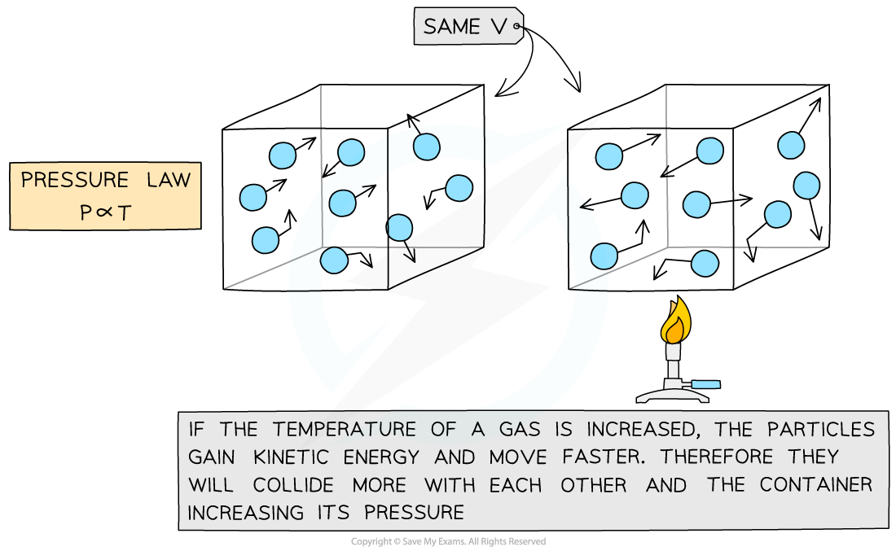

# The Pressure Law

## The pressure law

> **Spec point** — `spcpt_SbxyJyvfY8m4sSHr` · use the relationship between the pressure and Kelvin temperature of a fixed mass of gas at constant volume: P1 /T1 = P2 / T2

## The pressure law

- If the volume *V* of an ideal gas is constant, the **pressure law** is given by:

***P***** ∝ *****T***

- This means the pressure is **proportional** to the temperature

***Pressure and temperature are proportional. Doubling temperature also doubles the pressure for a gas in a fixed volume.***

- The relationship between the pressure and (Kelvin) temperature for a fixed mass of gas at constant volume can also be written as:

$\frac{p_{1}}{T_{1}}=\frac{p_{2}}{T_{2}}$

- Where:

  - *p**1* = initial pressure (Pa)
  - *p**2* = final pressure (Pa)
  - *T**1* = initial temperature (K)
  - *T**2* = final temperature (K)

***Pressure law graph representing temperature (in °C) directly proportional to the volume***

> **Worked Example**
> The pressure inside a bicycle tyre is 5.10 × 105 Pa when the temperature is 279 K. After the bicycle has been ridden, the temperature of the air in the tyre is 299 K. Calculate the new pressure in the tyre, assuming the volume is unchanged.
> 
> **Answer:**
> 
> **Step 1: Choose the correct ideal gas law**
> 
> - Volume is constant, so the pressure law must be used
> 
> $\frac{p_{1}}{T_{1}}=\frac{p_{2}}{T_{2}}$
> 
> **Step 2: Write down the known quantities**
> 
> - *p**1** = *5.10 × 105 Pa
> - *T**1* = 279 K
> - *T**2** = *299 K
> 
> **Step 3: Rearrange for *****p******2****** *****and substitute values into the pressure law**
> 
> - To make *p**2** *the subject, multiply both sides by* T**2 *to cancel out the *T**2** *in the fraction under* p**2*
> 
> `p subscript 1 over T subscript 1 space cross times space T subscript 2 space equals space fraction numerator p subscript 2 over denominator up diagonal strike T subscript 2 end strike end fraction space cross times space up diagonal strike T subscript 2 end strike`
> 
> $\frac{p_{1}}{T_{1}}\timesT_{2}=p_{2}$
> 
> - Substitute the known quantities
> 
> $p_{2}=\frac{5.10\times10^{5}}{279}\times299$
> 
> $p_{2}=5.47\times10^{5}\mathrm{Pa}$

> **Exam Hint**
> Remember when using gas laws the temperature *T *must always be in **kelvin **(K)!
