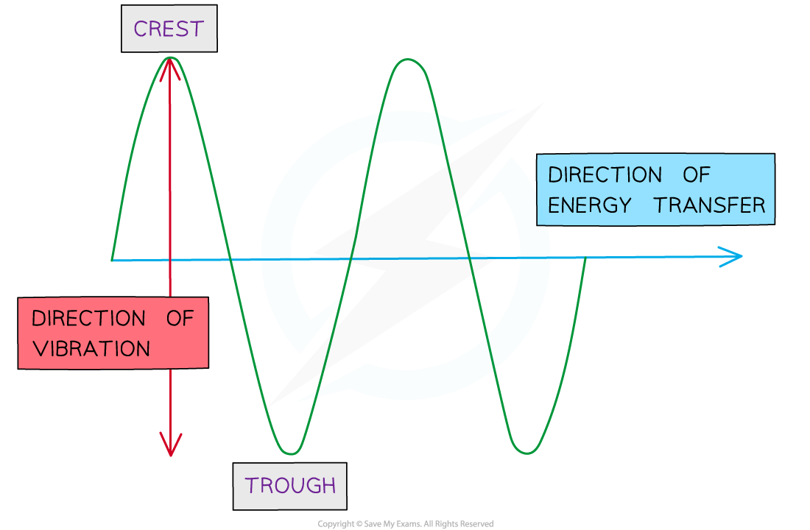

# Light & Sound Waves

## Light

> **Spec point** — `spcpt_KbXCXQZpNxjQDY8J` · know that light waves are transverse waves and that they can be reflected and refracted

## Light

- Visible light is a part of the [Electromagnetic spectrum](https://www.savemyexams.com/igcse/physics/edexcel/modular/24/unit-2/revision-notes/waves/waves-the-electromagnetic-spectrum/electromagnetic-waves/) which means it is a ***transverse wave***

  - This is explained in [Transverse & longitudinal waves](https://www.savemyexams.com/igcse/science/edexcel/double-award-modular/24/physics-unit-2/revision-notes/waves/waves-electromagnetic-spectrum/transverse-longitudinal-waves/)

#### Representing a transverse wave

***Light waves are transverse: the particles vibrate in a perpendicular direction to the energy transfer***

- Light can undergo:

  - [Reflection](https://www.savemyexams.com/igcse/physics/edexcel/modular/24/unit-2/revision-notes/waves/reflection-refraction/reflection-refraction/)
  - [Refraction](https://www.savemyexams.com/igcse/physics/edexcel/modular/24/unit-2/revision-notes/waves/reflection-refraction/reflection-refraction/)

## Sound

> **Spec point** — `spcpt_csCqV6JfsMWkwFhd` · know that sound waves are longitudinal waves which can be reflected and refracted

## Sound

- Sound waves are ***longitudinal waves***

  - This is explained in [Transverse & longitudinal waves](https://www.savemyexams.com/igcse/science/edexcel/double-award-modular/24/physics-unit-2/revision-notes/waves/waves-electromagnetic-spectrum/transverse-longitudinal-waves/)

- Longitudinal waves are usually drawn as several lines to show that the wave is moving **parallel** to the direction of energy transfer

  - Drawing the lines closer together represents the **compressions**
  - Drawing the lines further apart represents the **rarefactions**

#### Representing a longitudinal wave

***Longitudinal waves are represented as sets of lines with rarefactions and compressions***

- Sound can also undergo:

  - [Reflection](https://www.savemyexams.com/igcse/science/edexcel/double-award-modular/24/physics-unit-2/revision-notes/waves/reflection-refraction/reflection-refraction/)
  - [Refraction](https://www.savemyexams.com/igcse/science/edexcel/double-award-modular/24/physics-unit-2/revision-notes/waves/reflection-refraction/reflection-refraction/)
- The reflection of a sound wave is called an **echo**
