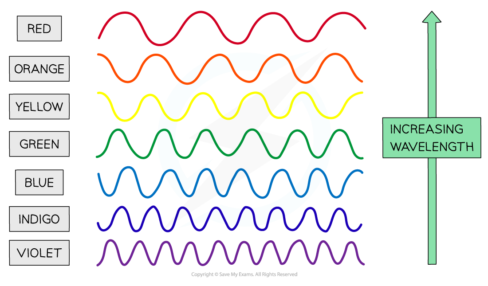

# Electromagnetic (EM) Waves

## Properties of em waves

> **Spec point** — `spcpt_J8JGjN7CJhPx676N` · know that light is part of a continuous electromagnetic spectrum that includes radio, microwave, infrared, visible, ultraviolet, x-ray and gamma ray radiations and that all these waves travel at the same speed in free space

## Properties of EM waves

- Light is part of a continuous **electromagnetic spectrum** that consists of the following types of radiation:

  - radio
  - microwave
  - infrared
  - visible
  - ultraviolet
  - x-ray
  - gamma ray
- All waves in the electromagnetic spectrum share the following properties:

  - They are all ***transverse***
  - They can all travel through free space (a **vacuum**)
  - They all travel at the **same speed** in free space

## The EM spectrum

> **Spec point** — `spcpt_5dw2F8r6C8dPQ4VJ` · know the order of the electromagnetic spectrum in terms of decreasing wavelength and increasing frequency, including the colours of the visible spectrum

## The EM spectrum

- The types of radiation found in the** electromagnetic spectrum** have a specific order based on their **wavelength** (and frequency)
- This order listed above has:

  - **radio waves** at one end because they have the **longest wavelength** (and **lowest frequency**)
  - **gamma rays** at the other end because they have the **shortest wavelength** (and **highest frequency**)
- Wavelength and frequency are **inversely proportional **to each other, which, according to the [Wave equation](https://www.savemyexams.com/igcse/science/edexcel/double-award-modular/24/physics-unit-2/revision-notes/waves/waves-electromagnetic-spectrum/wave-equation/), means that:

  - as wavelength **increases** (towards the red end of the spectrum), frequency **decreases**
  - as wavelength **decreases** (towards the violet end of the spectrum), frequency **increases**

#### Radiation in the EM spectrum, from longest to shortest wavelength

***Visible light is just one small part of a much bigger spectrum: The electromagnetic spectrum***

### The visible light spectrum

- Visible light is the **only** part of the EM spectrum detectable by the human eye

  - However, it is only a very small part of the **whole** electromagnetic spectrum
  - In the natural world, many animals, such as birds, bees and certain fish, can perceive beyond visible light and use infra-red and UV wavelengths of light to see

- Each colour within the visible light spectrum corresponds to a narrow band of ***wavelength*** and ***frequency***
- The different colours of visible light waves correspond to different wavelengths:

  - **red** light has the **longest** wavelength (and the **lowest **frequency)
  - **violet** light has the **shortest** wavelength (and the **highest** frequency)

#### The colours of the visible spectrum

***The colours of the visible spectrum: red has the longest wavelength; violet has the shortest***

> **Exam Hint**
> See if you can make up a mnemonic to help you remember the order of the colours of visible light in the EM spectrum!.
> 
> One possibility is:
> 
> **R**aging **M**artians **I**nvaded **V**enus **U**sing **X**-ray **G**uns
> 
> To remember the colours of the visible spectrum you could remember either:
> 
> - The name “Roy G. Biv”
> - Or the saying “Richard Of York Gave Battle In Vain”
> 
> 
> 
> You could even combine both to have a mega mnemonic:
> 
> **R**aging **M**artians **I**nvaded **Roy** **G**. **Biv** **U**sing **X**-ray **G**uns!
> 
> The electromagnetic spectrum is usually given in order of **decreasing wavelength** and **increasing frequency **i.e. from radio waves to gamma waves
> 
> Remember:
> 
> - Radios are **big** (long wavelength)
> - Gamma rays are emitted from atoms which are **very small** (short wavelength)
