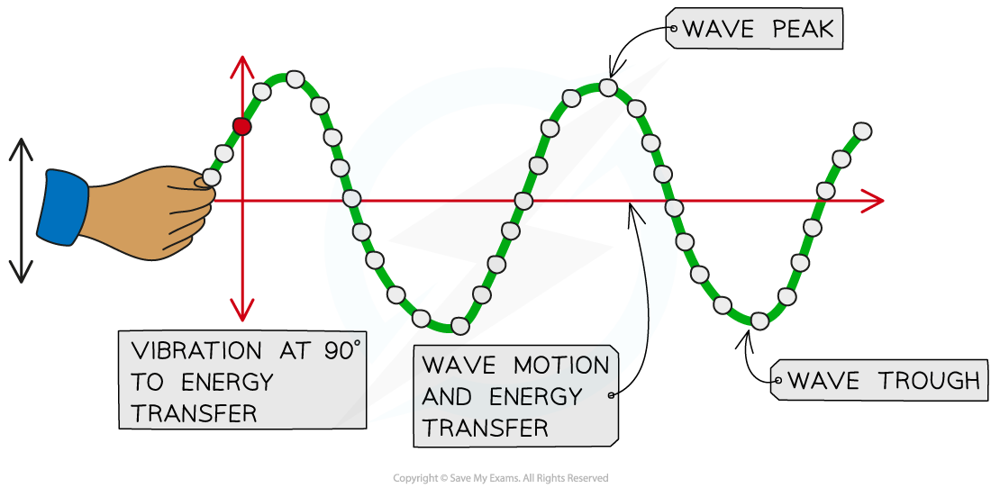
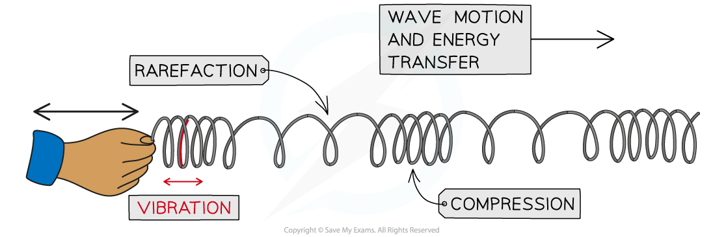
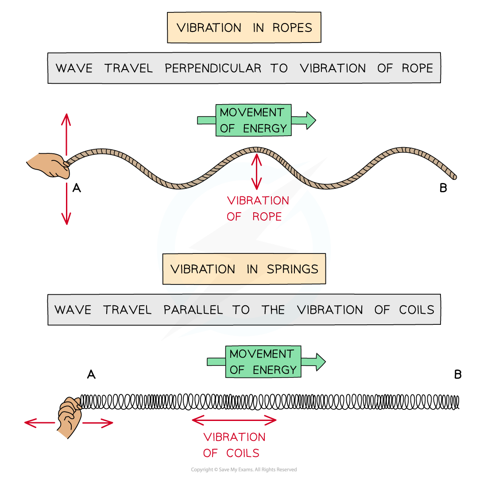

# Transverse & Longitudinal Waves

## Transverse & longitudinal waves

> **Spec point** — `spcpt_nvZs6Z2NqZBSPj3j` · explain the difference between longitudinal and transverse waves

## Transverse & longitudinal waves

- Waves can come in one of two types:

  - Transverse waves
  - Longitudinal waves

### Transverse waves

- Transverse waves are defined as:

**Waves that vibrate or oscillate perpendicular to the direction of energy transfer**

- Transverse waves:

  - oscillate **perpendicularly** to the direction of travel
  - transfer **energy**, but **not** the **particles** of the medium
  - can exist as mechanical waves which can travel in **solids **and on the **surfaces of liquids **but **not **through liquids or gases
  - can exist as [electromagnetic waves](https://www.savemyexams.com/igcse/science/edexcel/double-award-modular/24/physics-unit-2/revision-notes/waves/waves-electromagnetic-spectrum/electromagnetic-waves/) which can move in solids, liquids, gases and in a **vacuum**

- On a transverse wave:

  - the **highest **point above the rest position is called a **peak**, or **crest**
  - the **lowest **point below the rest position is called a **trough**

#### Example of a transverse wave

***Transverse waves can be seen in a rope when it is moved quickly up and down***

- Examples of transverse waves are:

  - ripples on the surface of water
  - vibrations in a guitar string
  - S-waves (a type of seismic wave)
  - electromagnetic waves (such as radio, light, X-rays etc)

### Longitudinal waves

- Longitudinal waves are defined as:

**Waves that vibrate or oscillate parallel to the direction of energy transfer**

- Longitudinal waves:

  - oscillate in the **same direction** as the direction of wave travel
  - transfer **energy**, but **not matter **(the particles of the medium)
  - can move in solids, liquids and gases
  - **cannot** move in a vacuum (since there are no particles)

- The key features of a longitudinal wave are where the points are:

  - close together, called **compressions**
  - spaced apart, called **rarefactions**

#### Example of a longitudinal wave

***Longitudinal waves can be seen in a slinky spring when it is moved quickly backwards and forward***

- Examples of longitudinal waves are:

  - sound waves
  - P-waves (a type of seismic wave)
  - pressure waves caused by repeated movements in a liquid or gas

### Comparing transverse & longitudinal waves

- Wave vibrations can be shown on **ropes** (transverse) and **springs** (longitudinal)

#### A comparison of longitudinal and transverse waves

***Waves can be shown through vibrations in ropes or springs***

#### Properties of transverse and longitudinal waves

| **Property** | **Transverse waves** | **Longitudinal waves** |
|---|---|---|
| Structure | Peaks and troughs | Compressions and rarefactions |
| Vibration | Perpendicular to the direction of energy transfer | Parallel to the direction of energy transfer |
| Vacuum | Can travel in a vacuum (electromagnetic waves) | Cannot travel in a vacuum |
| Material | Can travel through solids, and on the surface of liquids | Can travel through solids, liquids and gases |
| Density | Constant density | Changes in density |
| Pressure | Pressure is constant | Changes in pressure |
| Speed of wave | Depends on the material it is travelling through (fastest in a vacuum) | Depends on the material it is travelling through (fastest in a solid) |

> **Worked Example**
> The diagram below shows a loudspeaker generating sound waves, which travel to the right as indicated. Sound waves are longitudinal. A dust mote floats in the air just next to the loudspeaker, labelled **D**.
> 
> 
> 
> Draw arrows on the diagram to indicate how the dust mote **D** would vibrate as sound waves pass it.
> 
> **Answer:**
> 
> **Step 1: Recall the definition of longitudinal waves**
> 
> - Points along longitudinal waves vibrate **parallel** to the direction of energy transfer
> - This means the dust mote vibrates in a line **parallel** to the direction of the sound waves drawn
> 
> **Step 2: Draw arrows at the point labelled D to show it vibrating in parallel to the direction of the sound waves**
> 
> 

## Waves & energy

> **Spec point** — `spcpt_ZXdQ84K5D77zz99c` · know that waves transfer energy and information without transferring matter

## Waves & energy

- Waves are disturbances caused by an oscillating source that transfer **energy **and** information **without transferring matter
- Waves are described as **oscillations** or **vibrations** about a fixed point

  - For example, **ripples** cause particles of water to oscillate up and down
  - **Sound** waves cause particles of air to vibrate back and forth

#### Evidence that waves transfer energy and not matter

***Waves transfer energy and information, but not matter. This toy duck bobs up and down as water waves pass underneath***

- The wave on the surface of a body of water is a **transverse** wave
- The duck moves **perpendicular** to the direction of the wave

  - The duck moves up and down but does not travel with the wave

> **Exam Hint**
> Exam questions may ask you to describe waves, and this is most easily done by drawing a diagram of the wave and then describing the parts of the wave - a good, clearly labelled diagram can earn you full marks!
> 
> You may also be asked to give further examples of transverse or longitudinal waves - so memorise the lists given here!
