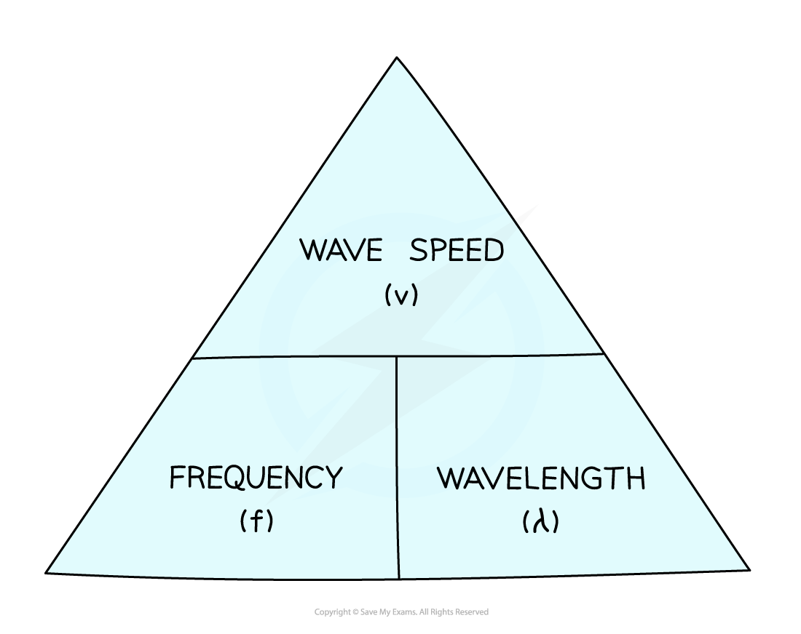

# The Wave Equation

## The wave equation

> **Spec point** — `spcpt_T6kSK6gX9S4Yh66t` · know and use the relationship between the speed, frequency and wavelength of a wave: 
wave speed = frequency × wavelength 
v = f × λ

## The wave equation

- All waves obey the **wave speed equation**

  - This is the relationship between the wave speed, frequency and wavelength of a wave

$v=f\timesλ$

- Where:

  - *v* = wave speed in **metres per second** (m/s)
  - *f* = frequency in **hertz** (Hz)
  - λ = wavelength in **metres** (m)

#### Formula triangle for the wave speed equation

***A formula triangle can be used to help rearrange the wave speed equation***

- For more information on how to use a formula triangle refer to the revision note on [Speed](https://www.savemyexams.com/igcse/science/edexcel/double-award-modular/24/physics-unit-1/revision-notes/forces-motion/movement-position/speed/)

## Frequency & time period

> **Spec point** — `spcpt_FtK5s898xkbYMc2z` · use the relationship between frequency and time period: frequency = 1 / time period 
f = 1 / T

## Frequency & time period

- **Frequency** and **time period** are defined in [Describing wave motion](https://www.savemyexams.com/igcse/science/edexcel/double-award-modular/24/physics-unit-2/revision-notes/waves/waves-electromagnetic-spectrum/describing-wave-motion/)
- The following equation relates **time period** and **frequency**:

$f=\frac{1}{T}$

- Where:

  - *f *= frequency, measured in **hertz** (Hz)
  - *T *= time period, measured in **seconds** (s)

> **Worked Example**
> Visible light has a frequency of about 6 × 1014 Hz.
> 
> How long does it take for one complete cycle of visible light to enter our eyes?
> 
> **Answer:**
> 
> **Step 1: List the known values**
> 
> - Frequency, *f *= 6 × 1014 Hz
> 
> **Step 2: State the relationship between frequency and time period **
> 
> - This question involves quantities of time and frequency, so the equation which relates **time** **period** and **frequency** of a wave is:
> 
> $T=\frac{1}{f}$
> 
> **Step 3: Substitute the known values into the equation and calculate the time period **
> 
> $T=1\div(6\times10^{14})=1.67\times10^{-15}s$
> 
> - Therefore, it takes **1.67 × 10****-15**** s** (to 2 decimal places) for one wave of visible light to pass our eyes

## Calculations in different contexts

> **Spec point** — `spcpt_h8jSXWBHj8tmp3J5` · use the above relationships in different contexts including sound waves and electromagnetic waves

## Calculations in different contexts

- The **wave equation** can be applied and rearranged to calculate the properties of [Transverse and longitudinal waves](https://www.savemyexams.com/igcse/science/edexcel/double-award-modular/24/physics-unit-2/revision-notes/waves/waves-electromagnetic-spectrum/transverse-longitudinal-waves/)
- The wave equation applies to all types of waves, including **[Sound](https://www.savemyexams.com/igcse/physics/edexcel/19/revision-notes/3-waves/3-3-sound/3-3-1-core-practical-investigating-the-speed-of-sound/)****[waves](https://www.savemyexams.com/igcse/physics/edexcel/19/revision-notes/3-waves/3-3-sound/3-3-1-core-practical-investigating-the-speed-of-sound/)** and **[Electromagnetic](https://www.savemyexams.com/igcse/physics/edexcel/19/revision-notes/3-waves/3-1-waves-and-the-electromagnetic-spectrum/3-1-5-electromagnetic-em-waves/)****[waves](https://www.savemyexams.com/igcse/physics/edexcel/19/revision-notes/3-waves/3-1-waves-and-the-electromagnetic-spectrum/3-1-5-electromagnetic-em-waves/)**

> **Worked Example**
> A certain sound wave moves at about 330 m/s and has a time period of 0.0001 seconds.
> 
> Calculate:
> 
> a) The frequency of the sound wave
> 
> b) The wavelength of the sound wave
> 
> **Answer:**
> 
> Part (a)
> 
> **Step 1: List the known quantities**
> 
> - Time period, *T* = 0.0001 s
> 
> **Step 2: Write out the equation relating time period and frequency**
> 
> $T=\frac{1}{f}$
> 
> **Step 3: Rearrange for frequency, f, and calculate the answer**
> 
> $f=\frac{1}{T}$
> 
> $f=\frac{1}{0.0001}$
> 
> $f=10000\mathrm{Hz}=1\times10^{4}\mathrm{Hz}$
> 
> Part (b)
> 
> **Step 1: List the known quantities**
> 
> - Wave speed, *v* = 330 m/s
> - Frequency, *f* = 1 × 104 Hz
> 
> **Step 2: Write out the wave speed equation**
> 
> $v=f\timesλ$
> 
> **Step 3: Rearrange the equation to calculate the wavelength**
> 
> $λ=\frac{v}{f}$
> 
> **Step 4: Use the frequency you calculated in part (a) and put the values into the equation**
> 
> `lambda space equals space fraction numerator 330 over denominator open parentheses 1 space cross times space 10 to the power of 4 close parentheses end fraction`
> 
> $λ=0.033m$

> **Worked Example**
> A local radio station broadcasts at a frequency of 200 kHz. The wavelength of these radio waves is 1500 m.
> 
> Calculate the speed of these radio waves and state an appropriate unit.
> 
> **Answer:**
> 
> **Step 1: List the known quantities**
> 
> - Frequency, *f* = 200 kHz = 200 000 Hz
> - Wavelength, λ = 1500 m
> 
> **Step 2: Write out the wave speed equation**
> 
> - This question requires wave speed, so state the equation linking wave speed, wavelength and frequency:
> 
> $v=f\timesλ$
> 
> **Step 3: Substitute the known values to calculate the wave speed **
> 
> $v=200000\times1500$
> 
> $v=300000000=3\times10^{8}$
> 
> **Step 4: State the unit with the answer**
> 
> - The units for speed are m/s
> - Therefore, the speed of these radio waves is **3 × 10****8 ****m/s**

> **Exam Hint**
> When stating equations make sure you use the right letters:
> 
> For example, use *λ* for wavelength, not L or W
> 
> If you can’t remember the correct letters, then state the word equations required
> 
> Be careful with units: wavelength is usually measured in metres and speed in m/s, but if the wavelength is given in cm you might have to give the speed in cm/s
> 
> Likewise, watch out for the frequency given in kHz: 1 kHz = 1000 Hz
